# AnimEditUtility

Unity の AnimatorController や VRCSDK3 の VRCExpressionParameters などを編集するユーティリティです。  
なお、このツールは「Avatars3.0 の AnimatorController 編集に慣れている人が、定形作業を効率化するために」作成したツールです。Avatars3.0 の知識をかなり使用しますのでご注意ください。

## 使い方

### ユーティリティを開く

Unity のメニューから `Tools` → `whiteflare` → `Anim Edit Utility` を選択すると、ウィンドウが開きます。

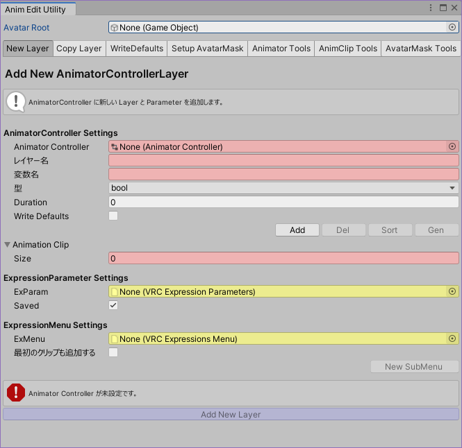

アバターのルートオブジェクトを `Avatar Root` に設定してください。
VRCAvatarDescriptor から AnimationController, ExpressionParameter, ExpressionMenu を検索してフィールドに設定します。

### 使い方A：New Layer (新規レイヤーの作成 → Parameters登録 → Menu登録) {#A}

この手順を実施すると、AnimatorController に新しいレイヤーが作成され、Parameters/Menu が追加されます。
予め切り替えたい AnimationClip を準備してください。

- AnimatorController に、AnimationClip を切り替える新規レイヤーを作成します。
- VRCExpressionParameters にパラメータを追加します。
- VRCExpressionMenu にメニューを追加します。

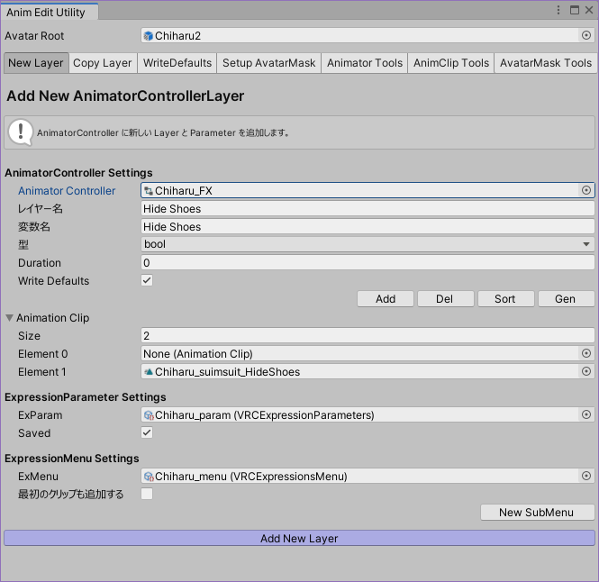

切り替える AnimationClip を設定します。欄は `Add` `Del` にて増減できます。
`Gen` を押すと、None が指定されている欄に新しい AnimationClip が作成されてセットされます。

`Add New Layer` を押すと、AnimatorController に新しいレイヤーが作成され、State と Transition が設定されます。また Parameters にも変数が追加されます。

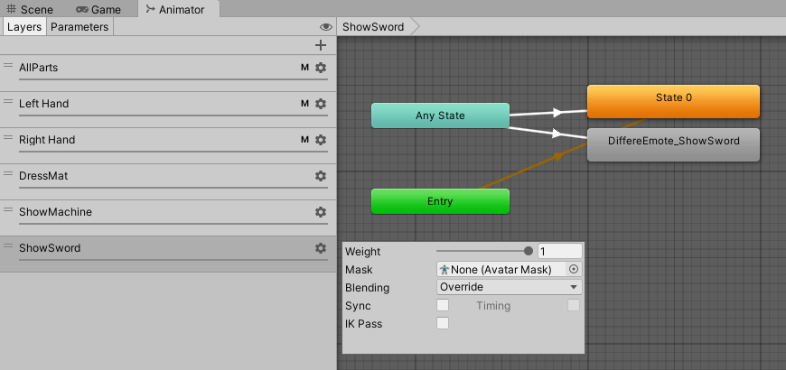

VRCExpressionParameters にパラメータが追加されます。

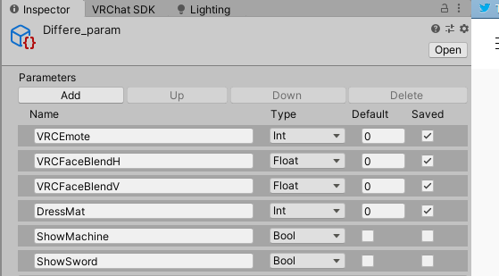

`Add Menu` を押すと、VRCExpressionMenu に Toggle タイプのメニューが追加されます。

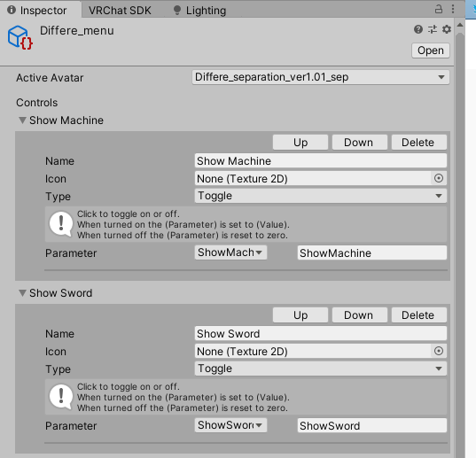

##### メモ

- AnimatorController への追加について
    - AnimatorController 内に、レイヤー名・変数名と同じものが存在する場合、注意を促すためフィールドが黄色になる。
        - レイヤー名と同じ名前のレイヤーが既にある場合、同名のレイヤーが追加される (レイヤー名は重複が認められている)。
        - 変数名と同じ名前のパラメータが既にある場合、新しいパラメータは作成されず、既存のパラメータを使う形で設定される。
    - レイヤー名と変数名には別の文字列を指定することもできる。
    - 変数の型は、Clip が2個までならば bool になるが、3個以上は int である必要がある。
    - AnimatorController の中に Write Defaults が true の state がひとつでもある場合は、Write Defaults のチェックボックスがオンになる。
    - Animation Clip を全て None でもレイヤー生成自体には問題ない。Motion が未指定の State が、指定の個数だけ用意される。
- VRCExpressionParameters への登録について
    - VRCExpressionParameters がフィールドに未指定の場合、パラメータの追加処理はスキップされる。
    - 追加しようとしている変数が既に存在する場合は追加しない。
- VRCExpressionsMenu への登録について
    - VRCExpressionsMenu がフィールドに未指定の場合、メニューの追加処理はスキップされる。
    - `最初のクリップも追加する` がチェックされていない場合、メニュー項目には Element 0 のクリップは追加されない。(通常が Clip 0 で、Toggle すると Clip 1～に切り替わるスタイルのメニュー)
    - `最初のクリップも追加する` がチェックされている場合、メニュー項目には Element 0 のクリップも追加される。(各状態を並べて、今がどの状態かリングメニューから確認できるスタイルのメニュー)
    - VRCExpressionsMenu に登録できる数は8個までなので、それ以上の項目は追加されずに無視される。
    - `New SubMenu` を押すと、新しい VRCExpressionsMenu が作成されてフィールドに設定される。
        - このとき新しい Menu が SubMenu として、元の Menu に追加される。(20220921版以降の仕様)

### 使い方B：Copy Layer (既存レイヤーのコピー) {#B}

AnimatorControllerLayer をコピーします。コピー元コピー先の AnimatorController は同じものを指定することもできますし、異なる AnimatorController を指定して AnimatorController 間でレイヤーをコピーすることもできます。

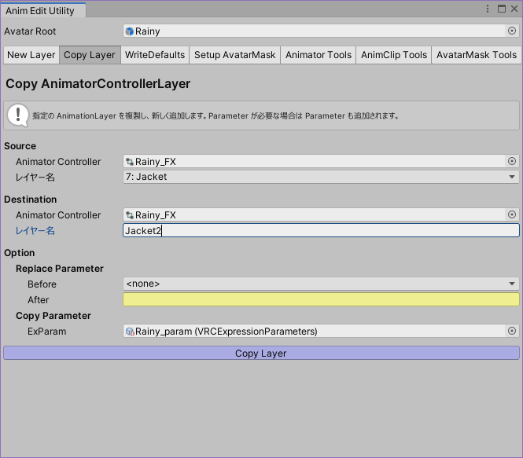

各レイヤーで使われている変数が、コピー先の AnimatorController に存在しない場合、新しい変数が追加されます。
ReplaceParameter が指定されているとき、コピー先のレイヤーに使われている変数が置換されます。
ExParam が指定されているとき、AnimatorController に新しい変数を追加するときに同時に VRCExpressionParameters にも新しい変数が追加されます。(ただし `IsLocal` といったVRCが動的に変更する変数は追加されません)

##### メモ

- コピー先 AnimatorController 内に、レイヤー名と同じものが存在する場合、注意を促すためフィールドが黄色になる。
    - レイヤー名と同じ名前のレイヤーが既にある場合、同名のレイヤーが追加される (レイヤー名は重複が認められている)。

### 使い方C：WriteDefault (オンで構成された AnimatorController  を WriteDefault オフに変更する) {#C}

WriteDefault オンで作成された AnimatorController を WriteDefault オフに変更します。

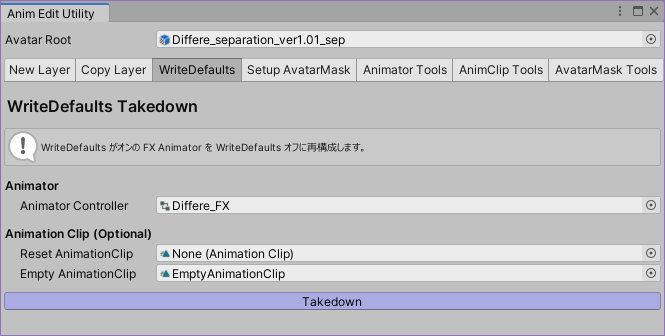

`Takedown` ボタンを押してください。
リセット用のアニメーションクリップが生成されるので、適当な場所に保存してください。(各アバターの `Animation` といった名前のフォルダに保存するのが良いでしょう。
『オブジェクトを変更しますか？』のダイアログにて OK を押すと、WriteDefaults がオフになります。

処理としては3つの動作を行います。
1. リセット用アニメーションクリップを生成し、最初のレイヤーの Default State に追加する
2. motion = None となっている全ての State に、Empty AnimationClip を設定する
3. 全ての State の WriteDefaults を False に設定する

### 使い方D：Setup AvatarMask (VRC Avatars3.0 の AvatarMask を構成する) {#D}

アバターに設定されたFX Controllerを読み取り、AvatarMask を構成します。古いアバターの Gesture が動かないケースの修復に使用できます。

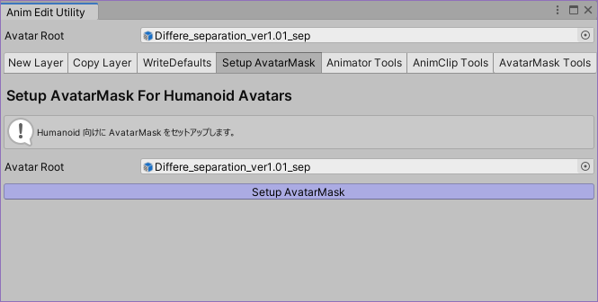

`Setup AvatarMask` ボタンを押してください。VRCAvatarDescriptor と AnimatorController を変更します。
また、必要があれば AvatarMask を生成して保存します。生成する場合は、保存先フォルダを指定するダイアログが開きます。生成が不要のときはダイアログは開きません。

この機能では、VRCAvatarDescriptor の PlayableLayers のうち、デフォルト指定されていない要素の AnimatorController をもとに処理を行います。
基本的な方針としては『Gesture の動きを邪魔しないような FX の AvatarMask を作成し、それを設定する』です。

### 使い方E：Animator Tools (その他のツール  Animator系) {#E}

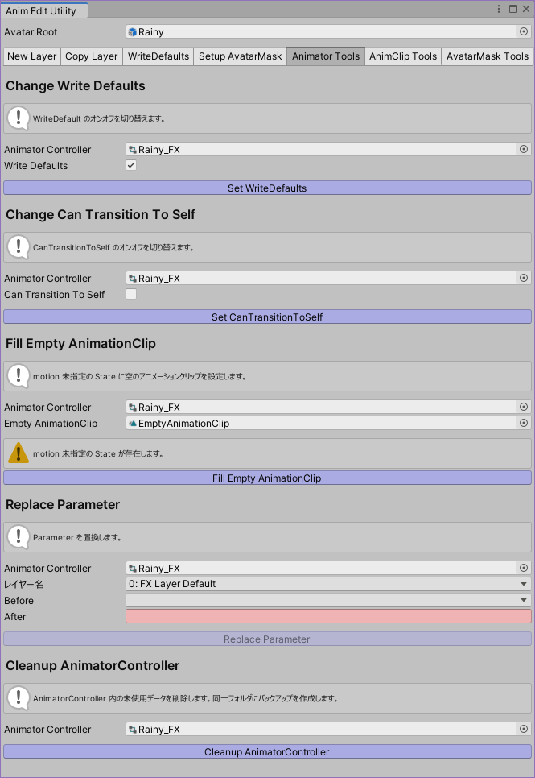

#### [E1] `Write Defaults` の一括設定 {#E1}

AnimatorController 内の State の Write Defaults を一括設定します。

#### [E2] `Can Transition To Self` の一括設定 {#E2}

AnimatorController 内の Transition の Can Transition To Self を一括設定します。

#### [E3] motion 未指定の State に EmptyAnimationClip を設定する {#E3}

AnimatorController 内にある motion 未指定の State に対し、指定された空AnimationClipを設定します。

#### [E4] AnimatorControllerParameter の名称を置換する {#E4}

AnimatorControllerLayer 内で使われている AnimatorControllerParameter の名称を置換します。

#### [E5] AnimatorState の名称を整理する {#E5}

指定の AnimatorControllerLayer 内にある State の名称に、AnimationClip の名称を設定します。
名称がレイヤー内で重複する場合は ` 1`, ` 2`, ... と連番を割り振ります。

#### [E6] AnimatorController のクリンナップ {#E6}

AnimatorController 内にある不要データを削除し、アセット容量の軽量化を施します。
元の Controller のバックアップとして、同じフォルダ内に `_bak` を付加したファイルを追加します。

### 使い方F：AnimClip Tools (その他のツール  AnimationClip系) {#F}

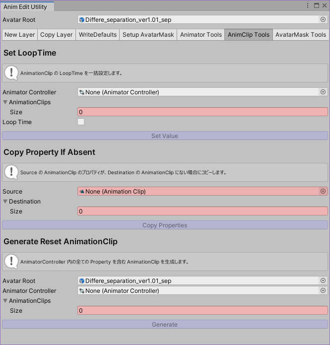

#### [F1] LoopTime の一括設定 {#F1}

AnimationClip の LoopTime を一括で設定します。

#### [F2] AnimationClip のプロパティコピー(ただし既に存在するものは置き換えない) {#F2}

Source に指定された AnimationClip から、Destination に指定した AnimationClip にプロパティをコピーします。ただし Destination に既に存在するプロパティはコピーされません。
Destination には複数の AnimationClip を指定することができます。

#### [F3] リセット用 AnimationClip の作成 {#F3}

複数の AnimationClip が変更する全ての Property を含む、ひとつの AnimationClip を作成します。
AnimatorController を指定して配下の AnimationClip を検索させることも、AnimationClip を直接指定することもできます。

### 使い方G：AvatarMask Tools (その他のツール  AvatarMask系) {#G}

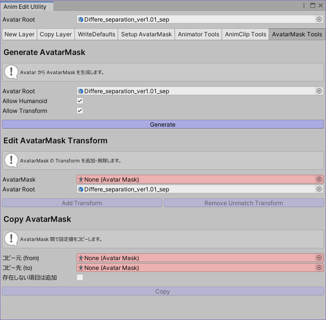

#### [G1] Generate AvatarMask {#G1}

Avatar Root をもとに AvatarMask の雛形を作成します。
初期値を指定することができ、`Allow Humanoid` は Humanoid 側の許可・拒否を、`Allow Transform` は Transform 側の許可・拒否をそれぞれ設定することができます。

#### [G2] Edit AvatarMask Transform {#G2}

AvatarMask 内に存在する Transform ヒエラルキーの追加・削除を行います。
`Add Transform` を押した場合、Avatar Root に含まれているが AvatarMask に含まれていないものを追加します。
`Remove Unmatch Transform` を押した場合、AvatarMask に含まれているが Avatar Root に含まれていないものを削除します。

#### [G3] Copy AvatarMask {#G3}

AvatarMask 間で設定値のコピーを行います。
`存在しない項目は追加` をチェックした場合、コピー元には含まれているがコピー先に含まれていない項目も、コピー先にコピーされます。チェックしていない場合、コピー元・コピー先のどちらにも含まれている項目のみ値がコピーされます。

