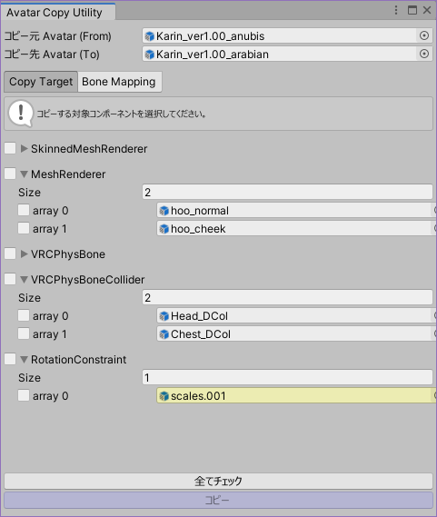

# AvatarCopyUtility

VRChat の各アバター間でコンポーネントをコピーするツールです。  
前提として VRCSDK3_Avatar が必要です。

## 何ができますか？

VRCPhysBone や Constraint の一括コピーおよび参照の貼り直しができます。

コピー可能なコンポーネントは以下のとおりです。
- Renderer系
    - SkinnedMeshRenderer
    - MeshRenderer + MeshFilter
    - ParticleSystem + ParticleSystemRenderer
- Constraint系
    - PositionConstraint
    - RotationConstraint
    - ScaleConstraint
    - ParentConstraint
    - LookAtConstraint
    - AimConstraint
- VRCSDK系
    - VRC_AvatarDescriptor
    - PhysBone
        - VRCPhysBone
        - VRCPhysBoneCollider
    - Contact
        - VRCContactSender
        - VRCContactReceiver
    - Constraint
        - VRCPositionConstraint
        - VRCRotationConstraint
        - VRCScaleConstraint
        - VRCParentConstraint
        - VRCLookAtConstraint
        - VRCAimConstraint

なお Cloth, DynamicBone のコピーには非対応です。

## 使い方

Unity の Menu → Tools → whiteflare → AvatarCopyUtility からウィンドウを開きます。

コピー元 Avatar およびコピー先 Avatar を設定し、コピー対象を選択、『コピー』ボタンを押すと、コピー元からコピー先にコンポーネントがコピーされます。

### ワンポイントアドバイス

- コンポーネントを単純にコピーするだけでなく、コピー先アバターへの参照の付け直しも行われます。SkinnedMeshRenderer の Bones, RootBone, AnchorOverride をはじめ、PhysBone の RootTransform などなどもコピー先に付け直されます。
- コピー元・コピー先のマッピングは、コピー先 Avatar を設定したタイミングで自動で行われ、Bone Mapping 側に表示されます。
    - GameObject の名称をもとに、類似の GameObject がマッピングされます。
    - コピー元・コピー先のボーン構造が異なっていても類似 GameObject をマッピングできているならばコピーに問題はありません。
    - コピー時、類似 GameObject のないコピー元は、コピー先に GameObject を新規作成します。
- マッピングできず付け直しに失敗し、コピー元への参照が残っている場合、コピー時に Console に警告が出力されます。

### マッピングの詳細な挙動

- GameObject の名称が一致した場合に、コピー元・コピー先の1対1マッピングとする。
    - マッピングは「Hips 配下にある GameObject どうし」「Hips 外にある GameObject どうし」で行い、それらで見つからない場合は「Avatar ルート配下の全域」の3段階で行う。
    - まずはAvatarルートからの相対パスにて比較し、見つからない場合はGameObjectの名称のみで比較を行う。ただし名称で対象をひとつに絞りきれなかった場合は、さらに親を含めて一致を比較する。
        - 例えばコピー元に `Avatar/A/B/C` というGameObjectが有る場合、コピー先から `Avatar/A/B/C`, `C`, `B/C`, `A/B/C` を順に検索し、1対1マッピングになるものを選択する。
- マッピングの決まっていない GameObject をコピーする場合は、コピー先に GameObject を新規で作成する。その際 GameObject の親 A がコピー先にマッピングされている場合、コピー先の親 A' の配下に GameOBject を作成する。

