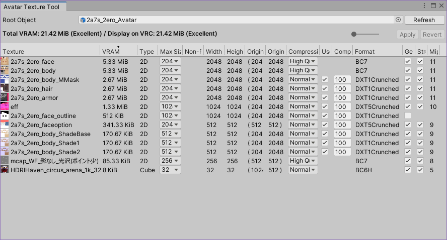

# AvatarTextureTool

VRChat のアバターが使用しているテクスチャのVRAMサイズを計測・一覧化し、設定を調整するためのツールです。

## 使い方

Unity の Menu → Tools → whiteflare → AvatarTextureTool からウィンドウを開きます。
Root Object にアバターのルートオブジェクトを指定すると、アバターが使用しているマテリアルとテクスチャを検索し、VRAMサイズを計算して表示します。

リストアップされた項目の一部は、AvatarTextureToolのウィンドウから直接編集することができます。
変更された値は黄色でマークされ、ウィンドウ右上の `Apply` ボタンを押すと反映されます。`Revert` ボタンを押すと反映せずに取り消されます。
複数行を選択した状態からいずれか1行を編集すると、その値は選択行すべてに反映されます。一括編集したい場合は複数行を選択してください。

リストを右クリックして `Find Reference in Materials` を選択すると、選択されたテクスチャを使用しているマテリアルが選択状態になります。

