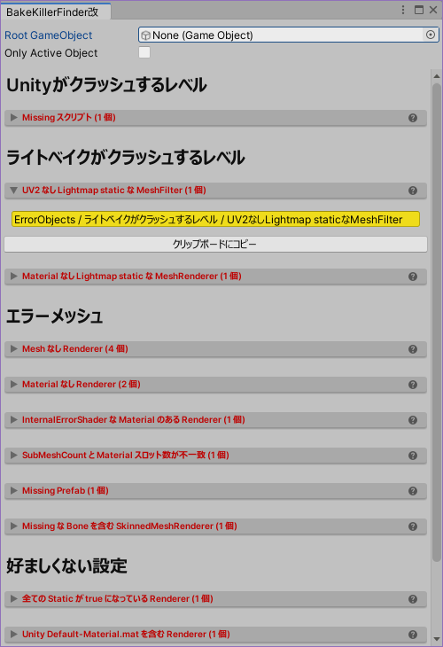

# BakeKillerFinder改二

シーン内に存在するエラーメッシュを検索する Unity 拡張エディタです。  
次のようなことができます。
- ライトベイク (Generate Lightings) が途中で失敗・長時間化したときの原因になったメッシュを検索する。
- ライトベイクが失敗・長時間化する可能性となるメッシュを事前に発見する。
- 描画不全を起こしているメッシュを検索する。

## 使い方

`Tools/whiteflare` → `BakeKillerFinder改二` から window を開くとこんな感じです。

`Examples`フォルダ内に、このツールで検出可能なエラーオブジェクトのサンプルを用意しています。
ツール動作確認および調査の練習にご利用ください。

## エラー解説: FATAL(致命的)

このセクションでは、UnityEditor での編集作業自体に影響する可能性があるオブジェクトを検出して列挙します。

### 【A1】 Missing Script が含まれています {#A1}

:::tip
Missing Script はプロジェクトが壊れた場合にも発生します。
:::

スクリプトのロードに失敗したコンポーネントを列挙します。  
多くの場合で Missing スクリプトは悪影響を与えず、単に無視されるはずのため問題にはなりません。しかし稀に UnityEditor や VRChat 自体をクラッシュさせる場合があります。
また Missing Script を含んだ Prefab は保存できない (保存時にエラーが表示される) ことから、Missing Script は原則として存在しない状態が望ましいです。  
ツール等スクリプトの導入状態を確認してインポートしなおしてください。または Missing Script を GameObject から削除してください。

### 【A2】 Missing Prefab です {#A2}

:::tip
Missing Prefab はヒエラルキーを一部構成できないことを示しています。
:::

Prefab アセットが Missing になっている場合、Unity はシーン内にオブジェクトを正常にロードできません。Hierarchyが正常にロードできていない状態のためFATALレベルで検出しています。  
Prefab アセットをインポートし、必要があればシーンに配置しなおしてください。

### エラー解説: ERROR(エラー)

このセクションでは、ライトベイクに支障があるオブジェクトを検出して列挙します。

### 【B1】 UV2のないメッシュはライトベイクできません {#B1}

:::tip
ライトベイクするメッシュにはUV2が必要です。
:::

ライトマップに書き込まれるメッシュ[^1]には、重なりのないUVマップが必要です。Unity では UV2 をライトマップ用のUVマップとして使用します。
UV2 が無い場合には UV1 がかわりに使用されますが UV1 はUVが重なっていたり範囲外になっていることもあり、UV1 をライトベイクに使用しても綺麗なライトマップが作成されなかったり、ライトベイクの長時間化や UnityEditor のクラッシュが発生することもあります。  
ライトベイク用の UV2 をメッシュに用意するか、または GenerateLightmapUVs をチェックして UV2 を生成してください。

[^1]: 具体的には ContributeGI = true かつ ReceiveGI = Lightmaps かつ ScaleInLightmap > 0 の MeshRenderer がライトマップに書き込まれます。

### 【B2】 TextMeshProメッシュはライトベイクできません {#B2}

:::tip
TextMeshProのメッシュはライトベイクしないようにしてください。
:::

TextMeshProは文字メッシュを生成しますが、このメッシュはライトベイクする想定になっていません。正しいライトマップUVが生成できず、ライトベイクの長時間化や UnityEditor のクラッシュが発生することもあります。  
TextMeshProのオブジェクトはライトベイクしないよう ContributeGIのチェックを外してください。

### 【B3】 Material なし MeshRenderer はライトベイクできません {#B3}

:::tip
ライトベイクにはマテリアルが設定されている必要があります。
:::

ライトマッパーはオブジェクトの色などの情報をマテリアルから取得します。そのためマテリアルが None または Missing になっている MeshRenderer はライトベイクには不適切です。
通常はメッシュの反射光が正しくないといった軽微な問題で済みますが、ライトベイクの長時間化や UnityEditor のクラッシュが発生することもあります。  
マテリアルを割り当て直すか、ライトベイクしないよう ContributeGIのチェックを外してください。

### 【B4】 非数(NaN)を含むメッシュはライトベイクできません {#B4}

:::tip
メッシュにNaNが含まれている場合、ライトベイクでエラーが発生します。
:::

メッシュのUV情報などに非数(NaN)が含まれている場合、ライトベイク時にエラーが発生することを Unity2022.3.22f1 にて確認しています。
FBXにNaNが含まれている場合は ModelImporter がNaNを0に置き換えて無害化するため、NaNが含まれている場合はUnityEditor上でツールが生成したメッシュということになります。  
メッシュを修正するか、ライトベイクしないよう ContributeGIのチェックを外してください。

### 【B5】 同一位置に同一設定値のBakedなPointライトが複数あります {#B5}

:::tip
BakedのPointライトが同一位置に存在する場合、BakedではなくRealtimeとして動作してしまいます。
:::

Unity2019～2022 には、同一座標に同一設定値の Baked の Point ライトが複数存在するとき、1つを除いて Baked ではなく Realtime ライトとして動作してしまうバグがあります。  
この項目が検知された場合、重複したライトを削除し、あるいは設定値を微調整してください。

## エラー解説: WARN(警告)

このセクションでは、描画に支障があるオブジェクトを検出して列挙します。

### 【C1】 Mesh が Missing です {#C1}

MeshFilter や SkinnedMeshRenderer にメッシュが未指定となっていて、そのままだと正しく描画されません。この状態ではマゼンタ色のエラー表示を出すこともできず、何も描画されません。  
メッシュの割当を確認してください。  
ツール等のスクリプトが実行前にメッシュを割り当てる場合は、このツールで検出されていても問題ありません。

### 【C2】 Material が Missing です {#C2}

MeshRenderer や SkinnedMeshRenderer にマテリアルが未指定となっていて、そのままだと正しく描画されません。この状態ではマゼンタ色のエラー表示として描画されます。  
マテリアルの割当を確認してください。  
ツール等のスクリプトが実行前にマテリアルを割り当てる場合は、このツールで検出されていても問題ありません。

### 【C3】 Shader が InternalErrorShader です {#C3}

マテリアルに使用しているシェーダが正しく動作していない場合、Unity は `Hidden/InternalErrorShader` という特殊なシェーダを用いてマゼンタ色のエラー表示として描画します。  
シェーダが動作するか確認し、修正してください。

### 【C4】 Material スロット数がメッシュ SubMeshCount よりも少ないです {#C4}

描画は Renderer の Material スロット数の回数だけ処理されます。メッシュ内のマテリアル数 (サブメッシュ数) よりもマテリアルスロット数が少ない場合、足りないサブメッシュは描画は描画されません。
この状態ではマゼンタ色のエラーは表示されず、ただサブメッシュが描画されない結果となります。  
マテリアルの割当を確認してください。

### 【C5】 Missing Prefab {#C5}

旧バージョンの BakeKillerFinder にて検出していた項目です。現在は「[【A2】 Missing Prefab です](#A2)」が表示されます。

### 【C6】 Missing な Bone を含む SkinnedMeshRenderer {#C6}

:::tip
ここで検出されたメッシュでは「ウェイトニードル」が発生する可能性があります。
:::

SkinnedMeshRenderer では変形のためにボーン (他のGameObjectのTransform) を使用しますが、ボーンを削除するなどした場合に bones 配列 (Inspector には表示されません) の要素が Missing になります。
Missing となったボーンに対するウェイトが塗られていた場合、Missing ボーンのかわりにゼロ座標が使用されるため、ワールド原点に向かって伸びるウェイトニードルとして観測されます。描画に支障があるためここで検出しています。

### 【C7】 BatchingStatic メッシュの SubMeshCount と Material スロット数が不一致です {#C7}

:::tip
マテリアルスロットを増減した MeshRenderer は Batching Static をオフにしてください。
:::

Batching static の付いたメッシュは、マテリアルスロットを追加して重ね塗りすることはできません。本来のサブメッシュ数にて描画されます。それにより一部描画に支障が出ますが、この問題はプレイモードに入らないと(Batchingを動作させないと)気付くことができません。  
Batching Static をオフにするか、マテリアルの割り当てを確認してください。  
なおシェーダ側でDisableBatchingが設定されているかどうかは判定していません。実際にはBatchingが動作せず問題が発生しない場合にも、ここでは検出するようになっています。

## エラー解説: INFO(情報)

このセクションでは、ただちに描画エラーに繋がるわけではないものの、ミスが含まれている可能性があったり、エラーを誘発しがちな設定を検出して列挙します。

### 【D1】 全ての Static が true になっています {#D1}

Inspector の右上にある Static のチェックボックスにて、GameObject に全ての Static を手軽に付与できます。しかし手軽に付与できるため、かえって問題のある設定をやってしまいがちです。

- Occluder static → 透過部分を含んでいるなど遮蔽物としては不適切な GameObject を Occluder として扱ってしまい、カリング暴れしてしまう
- Contribute GI → ライトベイクしないほうが綺麗に見えるオブジェクト (形状が複雑 or サイズが小さい or シェーダがベイクに対応していない) までベイク対象にしてしまう、あるいは大量のオブジェクトをベイクに巻き込むことによりベイク時間が数時間に及んでしまう

手軽だからといって全ての Static をチェックするのではなく、GameObject ごとの特性を踏まえて、個々の Static を設定するべきです。

### 【D2】 Default-Material.mat が設定された Renderer です {#D2}

通常であれば Assets フォルダ内にある個々のマテリアルを Renderer に指定することになるため、Default-Material を設定しているメッシュは設定漏れの可能性があります。
描画に問題がないケースが多いため Default-Material のままでも問題ありませんが、この項目が検出された場合は意図したものか確認してください。

### 【D3】 Unlitシェーダはライトマップを読み取らないため無駄が生じています {#D3}

ContributeGI がチェックされていればメッシュはライトマップにベイクされますが、ベイクされたライトマップをシェーダが無視する場合にはライトマップの無駄が生じてしまいます。
この検出項目ではライトベイクしているのに Unlit シェーダ(ライトマップを無視します)が使われているメッシュを検出します。
ReceiveGI を Lightmaps から LightProbes に変更して、ライトマップを削減してください。

### 【D4】 モデル組み込みマテリアルが使用されています {#D4}

Unity では FBX などのモデルデータからMaterialをインポートして使用することができますが、それらは編集不可なため通常ではAssets内に別途用意したマテリアルを使用する場合が大半です。  
この検出項目ではモデル組み込みマテリアルを使用している Renderer を列挙します。

### 【D5】 External Materials を使用したメッシュが使われています {#D5}

:::tip
FBXのインポート設定では `Use External Materials (Legacy)` を使用しないでください。
:::

FBXのインポート設定にて、Materials の Location に `Use External Materials (Legacy)` を指定しているメッシュを検出して列挙します。  
この指定の場合、FBXファイルとMaterialsフォルダの位置関係が変更された後にFBXの再インポートが動くと、Unityはマテリアルを見失うためFBXから再生成します。それによりマテリアル編集内容が初期化されてしまったように見える事象が発生します。  
できるだけ `Use External Materials (Legacy)` ではなく `Use Embedded Materials` を使用して Extract Materials ボタンを使用してください。
Embedded Materials であればマテリアル参照が Remapped Materials に保存されるため、FBXファイルやMaterialsフォルダを移動してもUnityはマテリアルを見失うことはありません。

## 謝辞

このツールは、元々バーチャルマーケット３の開発中に発生した、ライトベイク時のUnityクラッシュを解析するためのスクリプトでした。  
バーチャルマーケット４の開発においてさらに機能追加(魔改造ともいう)をしたものがこのツールです。  
スクリプトの開発は「車軸製作所」さん、魔改造は「フレア」が担当しました。
