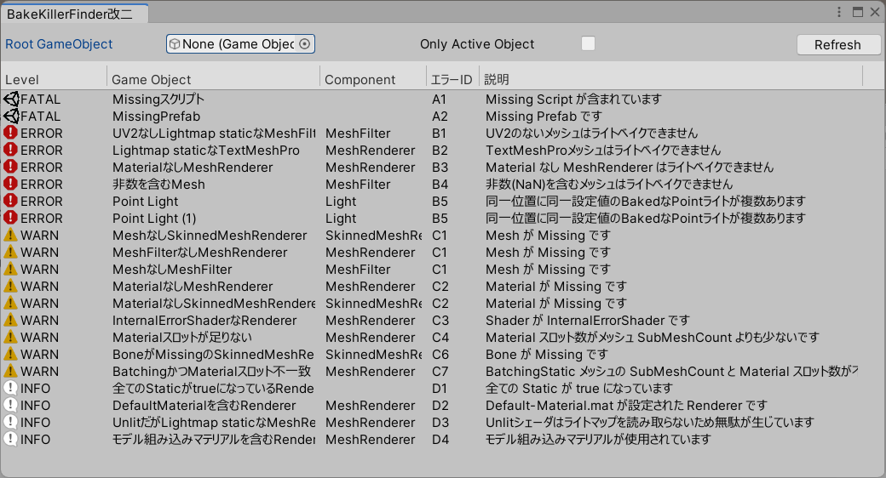

# BakeKillerFinder改

シーン内に存在するエラーメッシュを検索する Unity 拡張エディタです。  
次のようなことができます。
- ライトベイク (Generate Lightings) が途中でクラッシュしたときの原因になったメッシュを検索する。
- ライトベイクがクラッシュする可能性となるメッシュを事前に発見する。
- 描画不全を起こしているメッシュを検索する。

## 使い方

`Tools/whiteflare` → `BakeKillerFinder改` から window を開くとこんな感じです。

`Examples`フォルダ内に、このツールで検出可能なエラーオブジェクトのサンプルを用意しています。
ツール動作確認および調査の練習にご利用ください。

## 検出項目の詳解

### Unity がクラッシュするレベル

このセクションでは、UnityEditor での編集作業自体に影響する可能性があるオブジェクトを検出して列挙します。

#### Missing スクリプト {#A1}

スクリプトのロードに失敗したコンポーネントを列挙します。例えば DynamicBone 付きアセットを DynamicBone の無い環境に持ち込んだり、Bakery のライトを設置したシーンを Bakery の無い環境に持ち込んだ場合に検出されます。  
多くの場合で Missing スクリプトは悪影響を与えず、単に無視されるはずのため問題にはなりません。しかし何らかの条件で UnityEditor や VRChat 自体をクラッシュさせる現象を Unity2017.4.28f1 にて確認しています。  
また Missing スクリプトを含んだ Prefab は保存できない (保存時にエラーが表示される) ことから、Missing スクリプトは原則として存在しない状態が望ましいです。

### ライトベイクがクラッシュするレベル

このセクションでは、ライトベイクに支障があるオブジェクトを検出して列挙します。

#### UV2 なし Lightmap static な MeshFilter {#B1}

ライトマップに書き込まれるメッシュ (具体的には ContributeGI = true かつ ReceiveGI = Lightmaps かつ ScaleInLightmap != 0 のメッシュ) には、重なりのない UV が必要です。そのため Unity では UV2 をライトマップ用の UV として使用します。  
UV2 が無い場合には Progressive ライトマッパーは UV1 を使用しますが、UV1 はUVが重なっていたり範囲外になっている場合があり、そのため UV1 をライトベイクに使用するには不適切な場合があります。  
通常はメッシュ単体のライトベイク結果が汚れるだけで済みますが、これらのメッシュを含んだままベイクの負荷が高まった状態になると、UnityEditor 自体がクラッシュする現象を Unity2017.4.28f1 および Unity2018.4.20f1 にて確認しています。  
可能な限りライトベイクに適した UV2 をモデルに用意するか、GenerateLightmapUVs にて UV2 を生成してください。

#### Lightmap static な TextMeshPro {#B2}

ライトベイクにはメッシュ法線が必要ですが、TextMeshProは法線のないメッシュを作成します。そのため縦横に異常に拡大されたライトマップUVが生成され、これがベイク負荷を高めた結果クラッシュに至ることがあります。  
TextMeshProのオブジェクトはライトマップにベイクしないよう、ContributeGIのチェックを外してください。

#### Material なし Lightmap static な MeshRenderer {#B3}

ライトベイクする際には、オブジェクトの色などの情報をマテリアルから取得します。そのためマテリアルが None または Missing になっている MeshRenderer はライトベイクには不適切です。  
通常はメッシュの反射光が正しくないといった軽微な問題で済みますが、このオブジェクトを含んだままベイクの負荷が高まった状態になると、UnityEditor 自体がクラッシュする現象を Unity2017.4.28f1 にて確認しています。  
マテリアルを割り当て直すか、ContributeGI のチェックを外すなどライトマップ対象外としてください。

### エラーメッシュ

このセクションでは、描画に支障があるオブジェクトを検出して列挙します。

#### Mesh なし Renderer {#C1}

MeshRenderer などの Renderer ではメッシュを指定して描画しますが、そのメッシュが未指定であり正しく描画できないオブジェクトを検出します。この状態ではマゼンタ色のエラー表示を出すこともできず、何も描画されません。メッシュの割当を確認してください。

#### Material なし Renderer {#C2}

Renderer がメッシュを描画するためにはメッシュ自体の他にマテリアルも必要ですが、マテリアルが None や Missing となっている場合は正しく描画できず、マゼンタ色のエラー表示として描画されます。マテリアルの割当を確認してください。

#### InternalErrorShader な Material のある Renderer {#C3}

マテリアルに使用するシェーダが正しく動作していない場合、Unity は `Hidden/InternalErrorShader` という特殊なシェーダを用いてマゼンタ色のエラー表示として描画します。この場合はシェーダが動作するか確認し、修正してください。

#### SubMeshCount と Material スロット数が不一致 {#C4}

FBX内のマテリアル数 (サブメッシュ数) と Renderer の Material スロット数が不一致の場合、マゼンタ色のエラー表示として表示されることがあります。この付近の描画方法が UnityEditor と VRChat で異なり、UnityEditor ではエラーに見えないが VRChat ではマゼンタ色となる、といった事象を Unity2018.4.20f1 にて確認しています。  
なおFBX内のマテリアル数が 1 の場合に限り、Renderer の Material スロット数が複数であっても正しく描画されます。この条件は検出しないようになっています。

#### Missing Prefab {#C5}

Prefab アセットが Missing になっている場合、Unity はシーン内にオブジェクトを正常にロードできません。描画にも支障が出るためリストアップしています。Prefab アセットをインポートし、必要があればシーンに配置しなおしてください。

#### Missing な Bone を含む SkinnedMeshRenderer {#C6}

SkinnedMeshRenderer では変形のためにボーン (他のGameObjectのTransform) を使用しますが、FBX をシーンに展開した後に Unpack してボーンを削除するなどした場合に SkinnedMeshRenderer 内の bones 配列 (Inspector には表示されません) の要素が Missing になります。  
この状態で Missing ボーンに対するウェイトが塗られていた場合、Missing ボーンのかわりにゼロ座標が使用されるため、ワールド原点に向かって伸びるウェイトニードルとして観測されます。描画に支障があるためここで検出しています。

> SkinnedMeshRenderer はアーマチュアに存在する全ての GameObject を参照として保持しています。ウェイトが塗られていない場合はウェイトニードルにはなりませんが、内部的にはMissingとして扱われています。Unity上でボーンを削除したり、ボーン GameObject に EditorOnly を設定するなどした場合に発生します。ボーン削減する場合はFBX自体を編集してください。

### 好ましくない設定

このセクションでは、ただちに描画エラーに繋がるわけではないものの、ミスが含まれている可能性があったり、エラーを誘発しがちな設定を検出して列挙します。

#### 全ての Static が true になっている Renderer {#D1}

Inspector の右上にある Static のチェックボックスにて、GameObject に全ての Static を手軽に付与できます。  
しかし手軽に付与できるため、かえって問題のある設定をやってしまいがちです。

- Occluder static → 透過部分を含んでいるなど遮蔽物としては不適切な GameObject を Occluder として扱ってしまい、カリング暴れしてしまう
- Contribute GI (Lightmap static) → ライトベイクしないほうが綺麗に見えるオブジェクト (形状が複雑 or サイズが小さい or シェーダがベイクに対応していない) までベイク対象にしてしまう、あるいは大量のオブジェクトをベイクに巻き込むことによりベイク時間が数時間に及んでしまう

手軽だからといって全ての Static をチェックするのではなく、GameObject ごとの特性を踏まえて、個々の Static を設定するべきです。

#### Unity Default-Material.mat を含む Renderer {#D2}

通常であれば Assets フォルダ内にある個々のマテリアルを Renderer に指定することになるため、Default-Material を設定しているメッシュは設定漏れの可能性があります。  
または FBX 内 Hierarchy の整理のため頂点0個のメッシュが利用されていて、その Renderer が (もともと描画されていなくても構わないため) Default-Material のままとなっているのかもしれません。  
描画に問題がないケースが多いため Default-Material のままでも問題ありませんが、この項目が検出された場合は意図したものか確認してください。

#### Unlit シェーダだが Lightmap static になっている Mesh Renderer {#D3}

ContributeGI にチェックしてライトマップをベイクする設定となっていても、ライトマップを読まない Unlit シェーダが使用されている場合は単にライトマップの無駄になります。  
ReceiveGI を Lightmaps から LightProbes に変更して、ライトマップを他メッシュに譲ってください。

#### モデル組み込みマテリアルを含む Renderer {#D4}

Unity では FBX などのモデルデータからMaterialをインポートして使用することができますが、それらは編集不可なため通常ではExtract Materialsしたものを使用する場合がほとんどだと思います。この検出項目では、Extract Materialsされたマテリアルではなく、モデル組み込みマテリアルを使用している Renderer を列挙します。

## 謝辞

このツールは、元々バーチャルマーケット３の開発中に発生した、ライトベイク時のUnityクラッシュを解析するためのスクリプトでした。  
バーチャルマーケット４の開発においてさらに機能追加(魔改造ともいう)をしたものがこのツールです。  
スクリプトの開発は「車軸製作所」さん、魔改造は「フレア」が担当しました。
