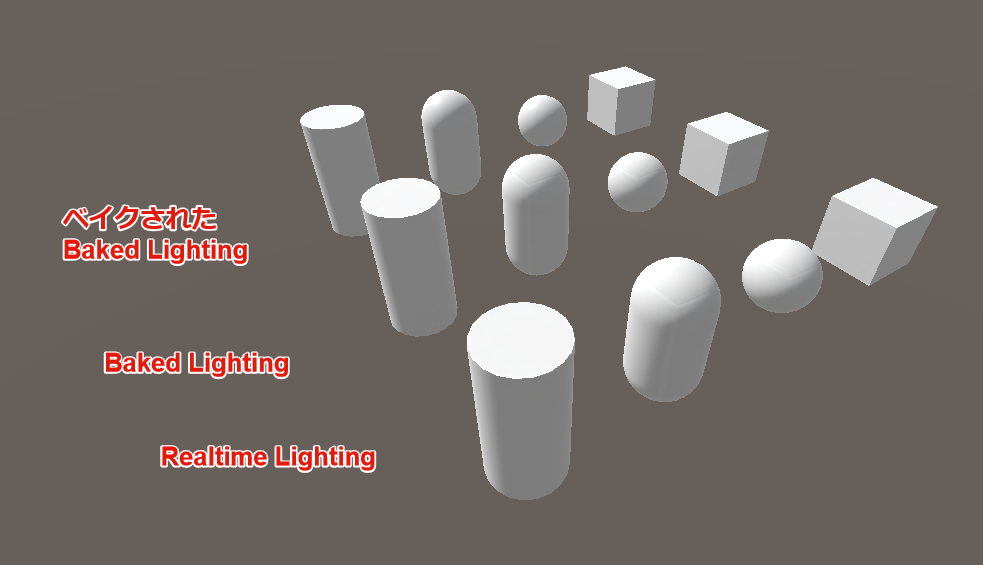
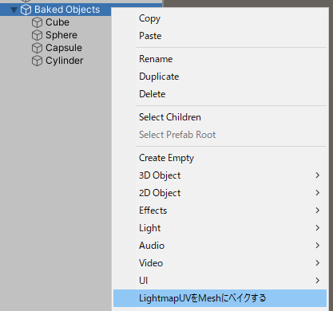
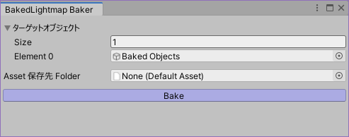
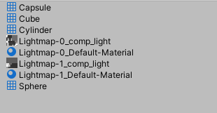

# BakedLightmapBaker

Unity (あるいは Bakery) の Lightmapper が算出した LightmapUV を Mesh オブジェクトにベイクすることで見た目を固定する Unity 拡張ツールです。
ライトマップの複製、LightmapUVをベイクしたMeshの作成、ライトマップを設定したマテリアルの作成を行います。

## 注意点

- シーン内の GameObject (および MeshFilter および MeshRenderer) に破壊的な変更を行います。
    - Undo は可能です。もし問題が生じた場合は Undo してください。
    - ツール処理前に Ctrl+D にて GameObject を複製してバックアップを取ることをおすすめします。
- ツール処理することでライトの当たり方が変化し、見た目が変化します。ツール処理後に改めて明るさ調整を行ってください。

## 使い方

### 0. ライトベイク

事前準備として、通常の方法でライトベイクを行い、ライトマップと LightmapUV の作成まで行ってください。
Lightmapper は Enlighten, Progress(CPU), Progress(GPU), Bakery いずれでも構いません。

### 1. ツールで処理

Hierarchy にてオブジェクトを選択し、右クリックから `LightmapUVをMeshにベイクする` を選択してください。

`Bake` ボタンを押すと、ターゲットオブジェクト配下からライトマップにベイクされた MeshRenderer を検索し、それらを処理します。

`Asset保存先Folder` が None の状態でボタンを押すと、フォルダ指定ダイアログが表示されます。保存先フォルダを指定してください。

### 2. 結果確認

ツール動作後、シーンまたは Prefab が破壊的に変更され、指定したフォルダには新しいメッシュとマテリアルが保存されます。

