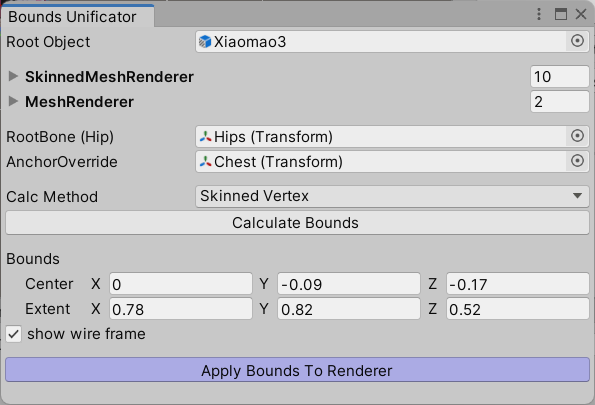
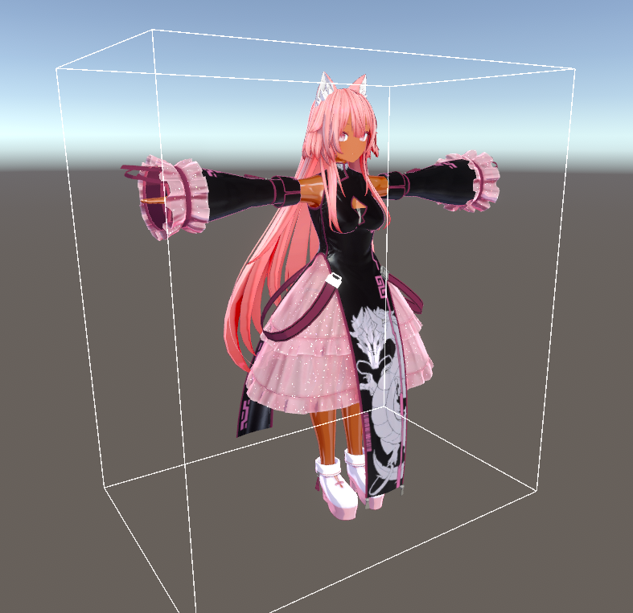

# BoundsUnificator

- SkinnedMeshRenderer の Bounds を統一し、`RootBone` や `AnchorOverride` を揃える Unity 拡張ツールです。

## 何ができますか？

複数メッシュの設定 [^1] を統一し、ライトからの影響ができるだけ均一になるよう設定します。  
`Bounds` 設定のミスで変にカリングされてしまうメッシュに対し、`Bounds` をリセットして正しく表示されるようにすることもできます。

[^1]: `Bounds` と `RootBone` と `AnchorOverride` を変更します

## 使い方

### 大雑把な流れ

`Tools` → `whiteflare` → `Bounds Unificator` から開くと、こんなウィンドウが出てきます。

1. `Root Object` にアバターのルートを設定してください。この配下から SkinnedMeshRenderer 等を検索します。VRC_AvatarDescriptor が付いていなくても問題ありません。
    - 設定すると `SkinnedMeshRenderer`, `MeshRenderer`, `RootBone (Hip)`, `AnchorOverride` が検索されて、自動で割り当てられます。
    - 自動割り当ての後に、設定を変更しても問題ありません。不都合がある場合はこのタイミングで差し替えてください。
2. `Calculate Bounds` ボタンを押すと、SkinnedMeshRenderer から AABB を自動で計算して `Bounds` に設定します。
    - 計算された値を後から変更しても構いません。ボタンを押さずにすべて手動で入れても良いです。微調整はこのタイミングで行ってください。
3. `Apply Bounds To Renderer` ボタンを押すと、ウィンドウ内の設定内容をもとに SkinnedMeshRenderer と MeshRenderer を書き換えます。
    - 問題がある場合は Undo (CTRL+Z) して元に戻してください。

`Apply Bounds To Renderer` の後、白枠 (SkinnedMeshRenderer の Bounds) がアバターを包んでいるかどうか[^2]結果を確認してください。

[^2]: メッシュが Bounds からはみ出していても問題ないのですが、あまりに掛け離れた場所に Bounds が設定されている場合、カリングが働いてメッシュが消えてしまうなどの問題が出てきます。

## 細かい仕様

### Calculate Bounds の計算について

- 計算方法は Calc Method から選ぶことができます。
    - `Prefab Value`: プレハブ(多くはFBX自体)のなかの SkinnedMeshRenderer に設定された Bounds をもとに AABB を計算します。
    - `Current Value Only`: プレハブ外にて現在設定された Bounds をもとに計算します。
    - `Bone Transform`: SkinnedMeshRenderer の Bounds は使用せず、各 SkinnedMeshRenderer のボーンの根元座標をもとに AABB を計算します。
- Bounds の値は、自動計算ではキリよく 0.01 単位になるはずです。

### RootBone の自動検索について

- `RootBone (Hip)` には、以下の順でオブジェクトを検索して最初に見つかったものが設定されます。
    1. Humanoid リグの Hips
    2. 見つからない場合、`Root Object` がそのまま設定されます。

### AnchorOverride の自動検索について

- `RootBone (Hip)` には、以下の順でオブジェクトを検索して最初に見つかったものが設定されます。
    1. `AnchorTarget` という名前のオブジェクト (レターケース不問、空白文字は無視)
    2. `AnchorOverride` という名前のオブジェクト (レターケース不問、空白文字は無視)
    3. Humanoid リグの Chest
    4. 見つからない場合、`Root Object` がそのまま設定されます。

### ボーンを持たない SkinnedMeshRenderer の扱いについて (ver2021/06/25)

- ボーンで動かない SkinnedMeshRenderer は、MeshRenderer と同じく AnchorOverride の統一だけするようになっています。

