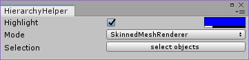
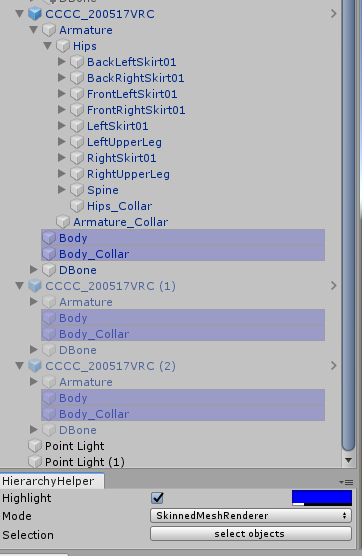

# HierarchyHelper

Unity の Hierarchy 表示を拡張する Unity 拡張エディタです。
特定条件の GameObject をハイライト表示したり選択したりすることができます。

## 使い方

`Tools` → `whiteflare` → `Hierarchy Helper` から window を開くとこんな感じです。

おすすめは、Hierarchy の下にドッキングさせるレイアウトです。ぜひお試しください。

- `Highlight` のチェックボックスで、強調表示を ON/OFF できます。ハイライトの色は ColorPicker で指定してください。
- `Mode` を変更すると、ハイライト対象の GameObject を切り替えることができます。
- `select objects` ボタンを押すと、ハイライト表示されているオブジェクトを選択することができます。

### モード一覧

1. **EditorOnly** - タグ EditorOnly が指定されている GameObject を強調表示します。
2. **Static** - 各Staticフラグが設定されている GameObject を強調表示します。
    1. **Batching Static**
    2. **Lightmap Static**
    3. **ReflectionProbe Static**
    4. **Occluder Static**
    5. **Occludee Static**
3. **Renderer** - 各Rendererコンポーネントがアタッチされている GameObject を強調表示します。
    1. **SkinnedMesh Renderer**
    2. **SkinnedMesh Renderer Bones**
    3. **Mesh Renderer**
    4. **ParticleSystem**
    5. **Traill Renderer**
    6. **Line Renderer**
4. Light - 各ライトコンポーネントがアタッチされている GameObject を強調表示します。
    1. **Realtime Light**
    2. **Mixed Light**
    3. **Baked Light**
    4. **LightProbeGroup**
    5. **ReflectionProbe**
5. **Contstraint** - Constraint(ParentConstraint, AimConstraintなど) がアタッチされている GameObject を強調表示します。
6. **VRC** - VRC関連のコンポーネントがアタッチされている GameObject を強調表示します。
    1. **PhysBone**
    2. **PhysBone Collider**
    3. **Contact Receiver**
    4. **Contact Sender**
    5. **Constraint** - VRCのConstraint(VRCParentConstraintなど) がアタッチされている GameObject を強調表示します。
7. **Missing Script** - MissingとなっているComponentがアタッチされている GameObject を強調表示します。
