# LightProbe Edit Utility

LightProbeGroup を編集するときの補助ツールです。  
『プローブの可視化』と『LightProbeGroupの編集』を行うことができます。  
VRCワールド制作向けに作成しました。

## 使い方

### LightProbe の可視化

`Assets/whiteflare/LightProbeEditUtility/LightProbeVisualizer.prefab` をシーンに展開してください。
Prefab にアタッチされているスクリプトが、操作パネルです。

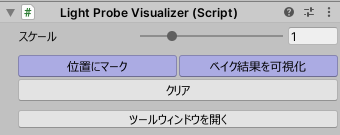

『ツールウィンドウを開く』ボタンを押すと、同様の操作パネルが別ウィンドウとして開きます。これは LightProbeGroup を編集しつつ、随時パネルを操作してマーカーを更新できて便利です。

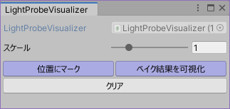

『クリア』を押すと追加したマーカー類を削除して綺麗にします。
『スケール』を変更するとマーカーの大きさを調整することができます。

追加したマーカーは LightProbeGroup の編集に伴い自動で反映する機能はありません。再度マーカーを追加するボタンを押して、表示を更新してください。

#### 位置にマーク

`位置にマーク` を押すと、シーン内にある全ての LightProbe の場所に、八面体のマーカーが追加されます。

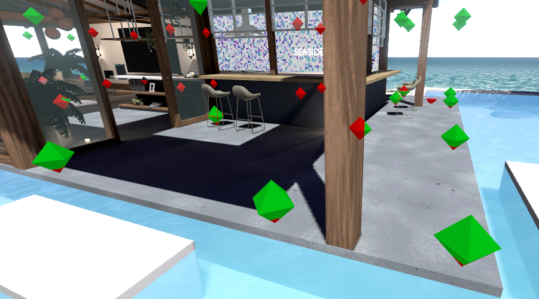

マーカーは2色で塗り分けられていて、

- 赤色：他のメッシュよりも奥に位置しているもの
- 緑色：他のメッシュよりも手前にあり、視点との間に遮るものが無いもの

となっています。
この色分けにより、LightProbe が地面や壁などに埋まっていないか確認することができます。

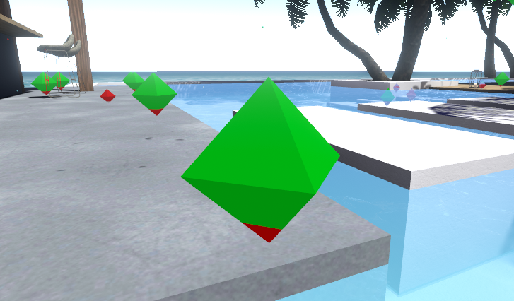

#### ベイク結果を可視化

`ベイク結果を可視化` を押すと、シーン内にある全ての LightProbe の場所に球形のマーカーが追加されます。

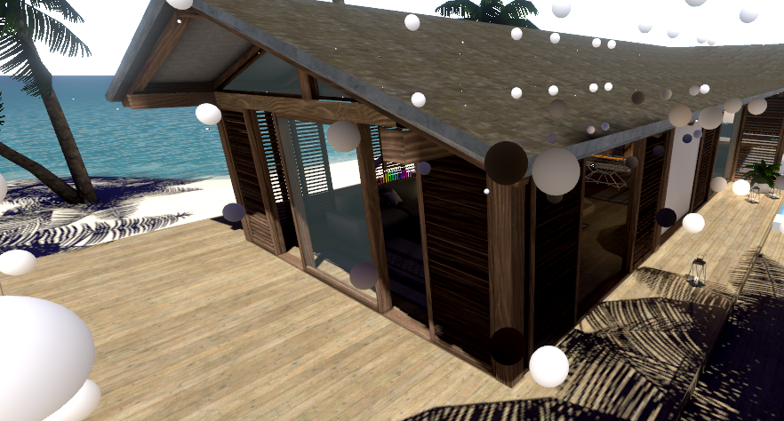

これらの球形マーカーには各 LightProbe のベイク結果が表示されます。これにより明るすぎるLightProbeや暗すぎるLightProbeを探すことができます。

### LightProbeGroup の編集

Hierarchy を右クリック → `ライトプローブ編集` から、LightProbeGroup を編集する幾つかの機能を扱うことができます。

#### 作成

LightProbe の個数を指定して、LightProbeGroup を生成します。

- Line
    - 直線上にプローブを配置します。 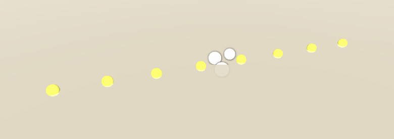
- Cage
    - キューブの辺上にプローブを配置します。 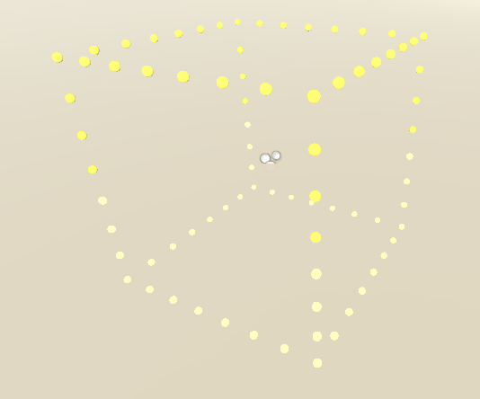
- Box
    - キューブの面上にプローブを配置します。 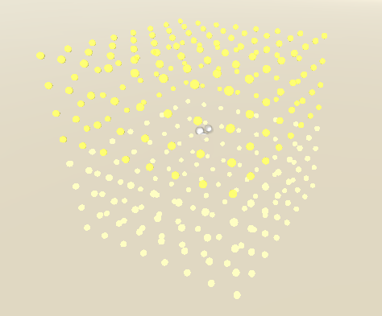
- Plane
    - 平面上にプローブを配置します。 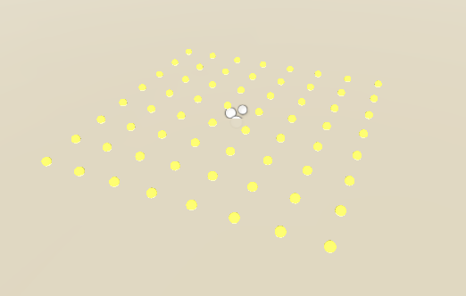
- Cylinder
    - 円筒形にプローブを配置します。 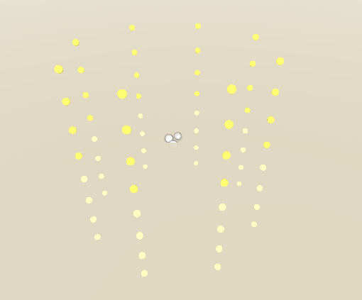

#### 統合

複数の LightProbeGroup を選択して『統合』を行うと、選択した LightProbeGroup をひとつに結合します。
結合先は「Hierarchyウィンドウで一番上に位置するLightProbeGroup」です。
他の LightProbeGroup は削除されます。

#### プローブを距離でマージ

LightProbeGroup を選択して『プローブを距離でマージ』を行うと、一定範囲内にあるプローブをひとつにマージします。

#### Transform変更/ワールド原点へ

LightProbeGroup を選択して『Transform変更/ワールド原点へ』を行うと、プローブの位置 (ワールド空間上の) を保持したまま、LightProbeGroup の Transform をリセットします。
これによって、各プローブの座標はワールド空間上の座標と等しくなります。

#### Transform変更/プローブの中央へ

LightProbeGroup を選択して『Transform変更/プローブの中央へ』を行うと、プローブの位置 (ワールド空間上の) を保持したまま、LightProbeGroup の Transform がプローブの中心に移動されます。
これによって、各プローブの座標は -1 ～ +1 の範囲内に収まるよう変換されます。

#### コライダーに落下させる

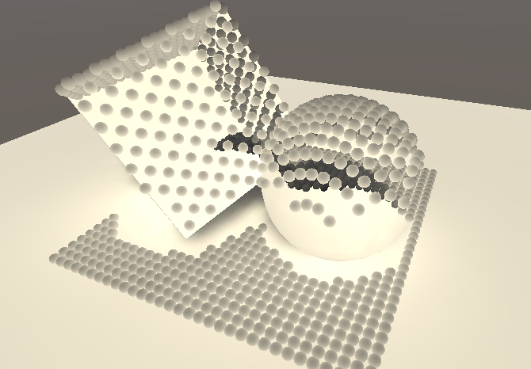

LightProbeGroup を選択して『コライダーに落下させる』を行うと、各プローブが何らかのコライダーに当たるまで指定の方向に移動します。

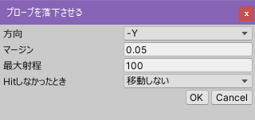

落下方向はデフォルトが -Y (下に落ちる) ですが、`方向` を変えることで任意の方向に移動させることができます。
`マージン` はコライダーとの間隔です。例えば `0.05` と指定すると、コライダーから 0.05 メートルの間隔を保持します。
`最大射程` はコライダーに当たるまでに移動できる最大の距離です。最大射程に達するまでにコライダーに当たらなかったときの挙動は `Hitしなかったとき` で指定できます。

- 移動しない：当たらなかったプローブは、編集前の位置から移動しません。
- 移動する：当たらなかったプローブは、最大射程で指定した距離だけ移動します。
- 削除する：当たらなかったプローブは削除されます。
