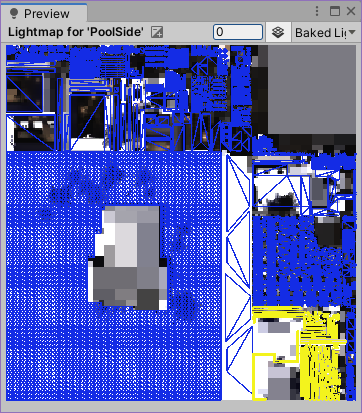

# Lightmap Control Panel

MeshRenderer のライトマップに関する設定を一括で行うためのツールです。  
VRCワールド制作向けに作成しました。

## 使い方

### 基本操作

ウィンドウは `Tools/whiteflare/Lightmap Control Panel` から開くことができます。
開いているシーン内にある全ての MeshRenderer がリストアップされます。

### 表示範囲の指定

表示範囲を限定することができます。

- `Root Object`
    - GameObject を指定すると、その配下の MeshRenderer のみリストアップします。未指定のときはシーン全体の MeshRenderer をリストアップします。
- `Filter`
    - 特定の条件に合致するオブジェクトのみをリストアップします。
    - None: フィルタは無効です。全てのオブジェクトがリストアップされます。
    - Only ContributeGI: `ContributeGI` が ON のオブジェクトのみリストアップされます。
    - Only Lightmapped: ライトマップを使って描画するオブジェクトのみリストアップされます。
    - Not ContributeGI: `ContributeGI` が OFF のオブジェクトのみリストアップされます。
    - Not Lightmapped: ライトプローブを使って描画するオブジェクトのみリストアップされます。
- `Only Active Object`
    - チェックすると、アクティブなオブジェクトのみリストアップされます。

### 表示内容の解説

- GameObject列、Mesh列は、対象のGameObjectの名称と、Meshの名称を列挙しています。BoundsSize列は、対象のMeshRendererのバウンディングボックスの大まかなサイズです。
    - BoundsSizeの計算方法は「Boundsの各面(XY, YZ, ZX)の面積の最大値の平方根」で、単位はメートルです。
- Layer列、CastShadows列、ReceiveShadows列、ContributeGI列、ReceiveGI列、ScaleInLightmap列、StitchSeams列は、それぞれのGameObject/MeshRendererの設定項目に対応しています。これらは編集可能です。
- 以降の列は、各オブジェクトの設定値を表示します。
    - LightmapIndex ... 割り当てられたライトマップのインデックスです。 ライトプローブを使うまたは未ベイク状態では空欄となります。
    - AreaWidth, AreaHeight ... 割り当てられたライトマップ領域の幅と高さを px 単位で表示します。
    - AreaSize ... 割り当てられたライトマップ領域の面積の平方根を px 単位で表示します。
    - LightmapSize ... 割り当てられたライトマップの全体の大きさを px 単位で表示します。
    - HasUV2 ... そのメッシュにUV2が存在するならば True、存在しないならば False を表示します。
    - GenerateLightmapUVs ... そのメッシュの MeshImporter で GenerateLightmapUVs がチェックされている場合は True、されていない場合は False を表示します。

あるメッシュに対するライトマップ領域の大きさを比較したい場合は、Area Size で並び替えると便利です。

### 編集操作

一部の列は編集可能になっています。1箇所を変更すると即座にInspectorにも反映されます。
複数行を選択して、選択したいずれかの行を変更すると、その設定値を選択した行すべてに反映します。一括編集するときはその要領にて、複数選択して変更してください。

### コンテキストメニュー

列を右クリックでコンテキストメニューが開きます。

- Select GameObjects, Select Meshes, Select Model Import Settings, Select Lightmaps ... 選択した行のそれぞれの要素を選択状態にします。
- Set ScaleInLightmap ... 選択した行の ScaleInLightmap を一括変更します。`x2.0` を選ぶと2倍になり、`x0.5` を選ぶと0.5倍になります。

### その他のノウハウ

LightmapControlPanel の行をクリックすると、Hierarchy 上でも該当する GameObject が選択状態になります。
一方、UnityEditor では標準機能として、選択したオブジェクトのライトマップ上の位置を図示するプレビュー機能があります。
そのため LightmapControlPanel にて `Area Size` の降順で並び替えたあと上から順に選択していくと、ライトマップ上にどの順番で配置されたか知ることができて興味深いです。

