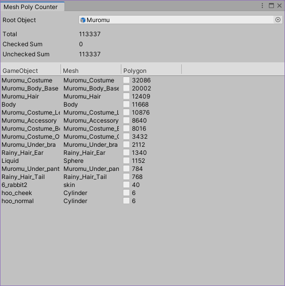

# MeshPolyCounter

VRChatアバター内のポリゴン数をカウントするUnity拡張ツールです。

## 使い方 

`Tools` → `whiteflare` → `Mesh Poly Counter` から開くと次のウィンドウが出てきます。
開く際に Hierarchy で選択されている GameObject が `Root Object` に指定された状態でウィンドウが開きます。

`Root Object` に、計測したい GameObject のルートを指定します。
GameObject を指定すると、その配下の Mesh をリストに一覧表示し、合計ポリゴン数を `Total` に表示します。

Polygon列のチェックボックスを切り替えると、指定されたメッシュのポリゴン数を除いてor含めて合計を計算することができます。
`Checked Sum` は、チェックされているメッシュのポリゴン数の合計です。
`Unchecked Sum` は、チェックされていないメッシュのポリゴン数の合計です。

チェックボックスを切り替えても、元の GameObject は一切変更されません。単純に計算のためだけに使用できます。
