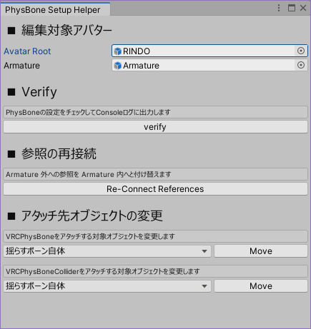

# PhysBoneSetupHelper

VRChat のアバターに PhysBone を設定する際の支援スクリプトです。UnityEditor の拡張として動作します。

## 使い方

### 1. 基本操作

ツールウィンドウは、Unity メニューの `Tools/whiteflare` → `PhysBone Setup Helper` から開くことができます。
開く際に Hierarchy にてアバターが選択されているならば、そのオブジェクトを編集対象として扱うことができます。

Avatar Root に VRC_AvatarDescriptor の付いたオブジェクトを指定してください。
指定したオブジェクト配下に “Armature” という名前のオブジェクトがある場合、Armature も同時に設定されます。自動設定されない場合は Armature にもオブジェクトを指定してください。

### 2. Verify

PhysBoneの設定をチェックしてConsoleログに出力します。次のような設定を見つけた場合にはログに警告が出力されます。

- `Ignore Transforms`, `Colliders` に None(null) が含まれている
- `Root Transform`, `Ignore Transforms`, `Colliders` に Armature 外のオブジェクトが指定されている
- 動かす Transform が0個 (リーフボーンが無い or `Endpoint Position` が未設定 or `Multi Child Type` が Ignore に設定されている)
- ひとつの Transform が複数の PhysBone によって揺らされている
- どの PhysBone からも使われていない PhysBoneCollider

### 3. 参照の再設定

Avatar Root 配下の全ての PhysBone および PhysBoneCollider について、参照先の Transform が Armature 外にある場合、同名の Transform を検索して参照を付け替えます。同名の Transform が見つからなかった場合は何もしません。
この機能はPhysBone の値コピーなどによってコピー元の Transform を参照し続けている場合に、コピー先の参照へと付け替えるための機能です。

### 4. アタッチ先オブジェクトの変更

PhysBone のコンポーネントを付ける先の GameObject を変更することができます。このツールでは以下のパターンに対応しています。

1. 揺らすボーン自体
    - PhysBone の Root Transform に指定されている(つまり揺らす対象の)ボーンオブジェクトにコンポーネントをアタッチします。
2. 独立したオブジェクト
    - Hierarchy に `PhysBone` または `PhysBoneCollider` という名称のオブジェクトを作成し、さらに下に揺らす対象と同名のオブジェクトを作成し、それにコンポーネントをアタッチします。
