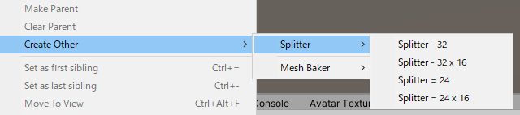
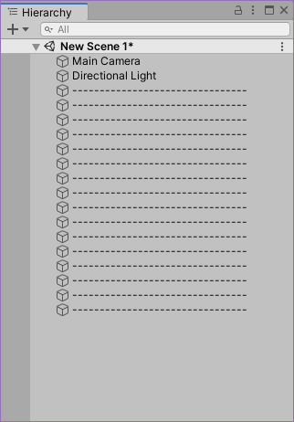

# SplitterObject

Unity の Hierarchy に区切り線を追加するだけのUnity拡張ツールです

## 使い方 

UnityEditor のメニュー `GameObject` → `Create Other` → `Splitter` から区切り線 GameObject をシーンに追加できます。

追加される GameObject には `EditorOnly` が設定されています。
また特殊な Component は付いていないため、この拡張ツールの無い環境でシーンを開いても問題は発生しません。

