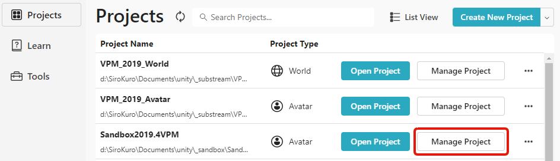
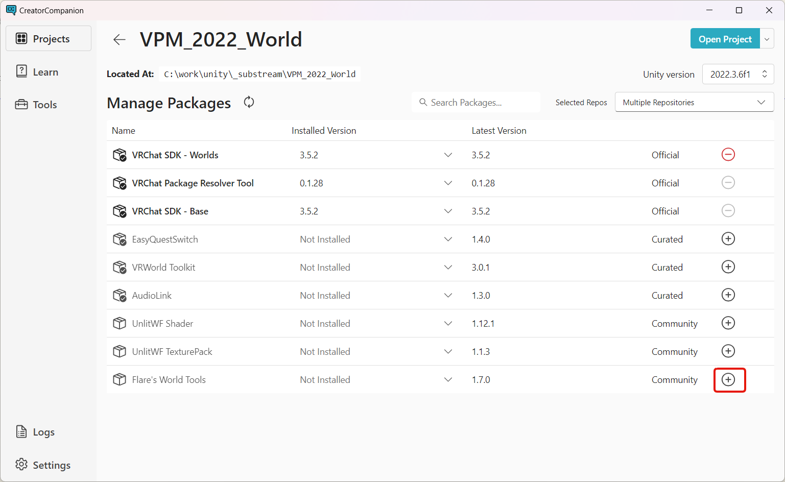
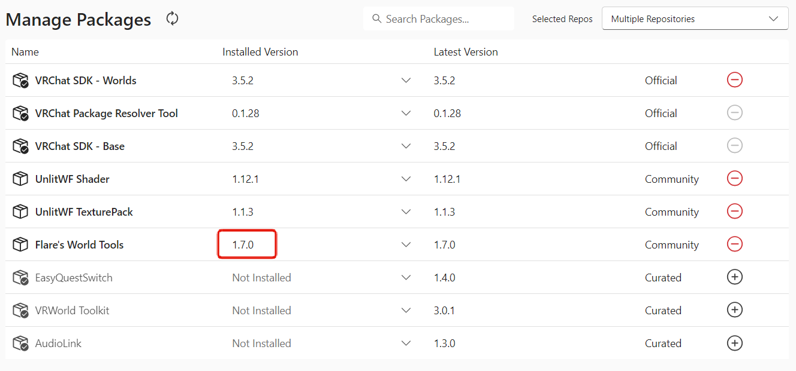
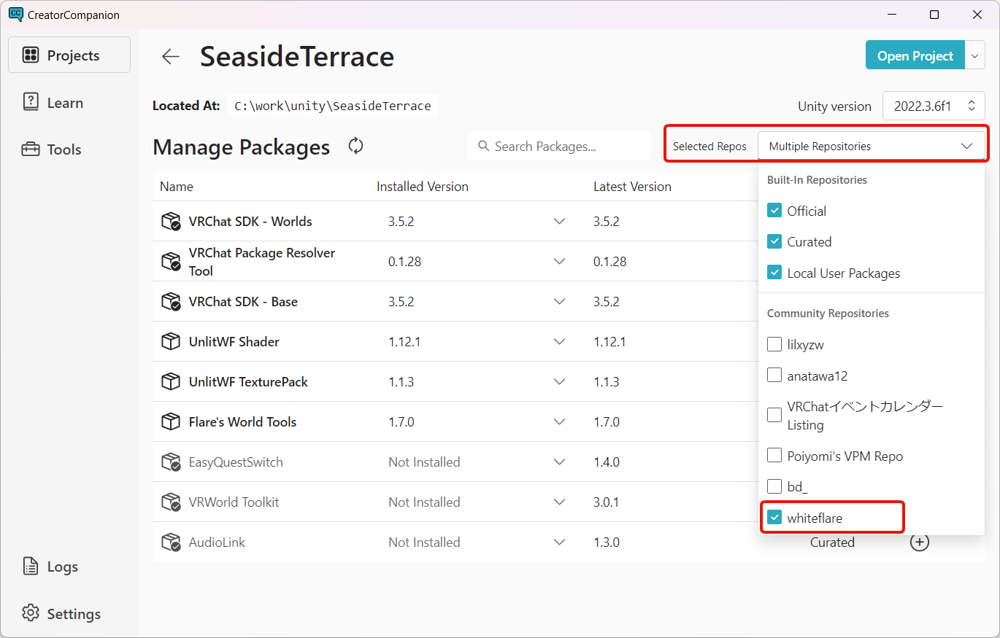

# Flare's ToolsのVPM版パッケージ導入手順

Flare's ToolsをVPMリポジトリ経由でプロジェクトにインポートする手順をご案内します。

1. リポジトリをVCCに追加する
2. Flare's Tools をプロジェクトに追加する

## 導入手順

### 1. リポジトリをVCCに追加する

Flare's Tools を配布しているVPMリポジトリをVCCに追加します。  
[VCCに追加する](https://whiteflare.github.io/vpm-repos/addrepos.html) を開いてください。VCCが起動し、リポジトリ追加のダイアログが表示されます。

`I Understand, Add Repository` ボタンを押すとVCCにリポジトリが追加されます。  
すでに追加済みの場合は次のようにエラーが出ますが、この場合は追加が済んでいるので後続の手順に進んでください。

### 2. Flare's Tools をプロジェクトに追加する

VCCにて追加先のプロジェクトの `Manage Project` に進みます。

Project Type がアバターの場合は `Flare's Avatar Tools` が、ワールドの場合は `Flare's World Tools` が一覧に表示されます。
右側の `+` ボタンを押すと、パッケージがプロジェクトに追加されます。

Flare's Tools の Installed Version が `Not Installed` から具体的なバージョン番号に変化すれば導入完了です。

`Flare's Avatar Tools` および `Flare's World Tools` が表示されない場合、コミュニティリポジトリが非表示になっている場合があります。
右上の `Selected Repos` から `whiteflare` のリポジトリにチェックを入れてください。

