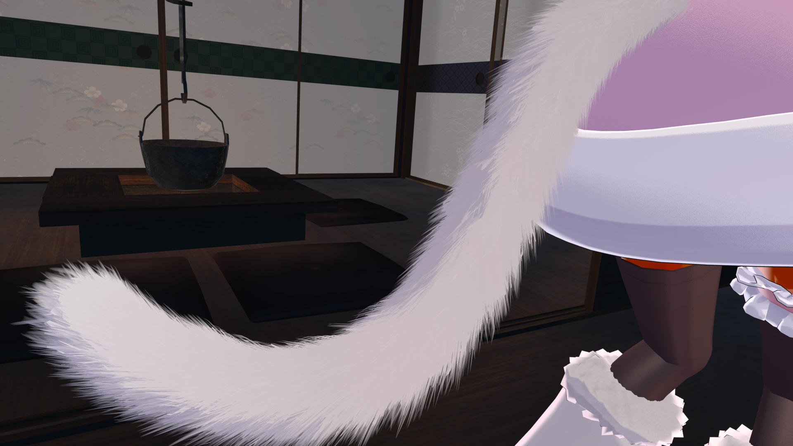
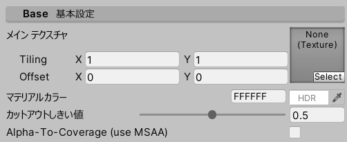
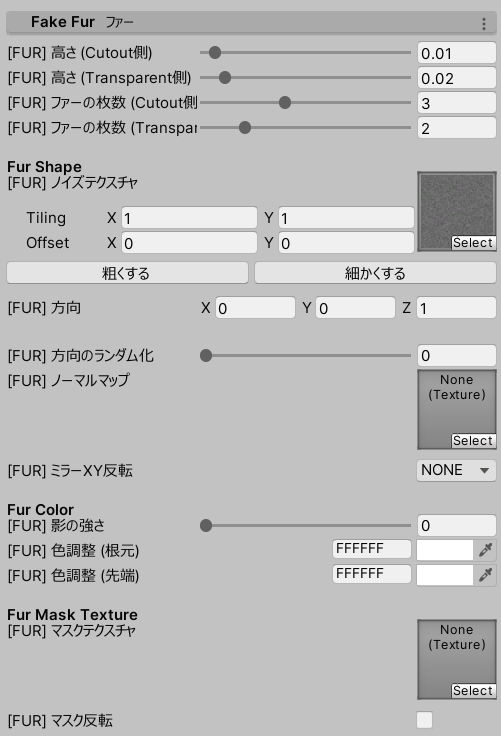
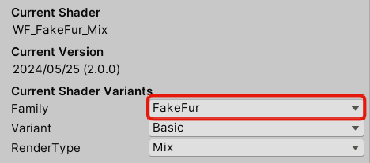
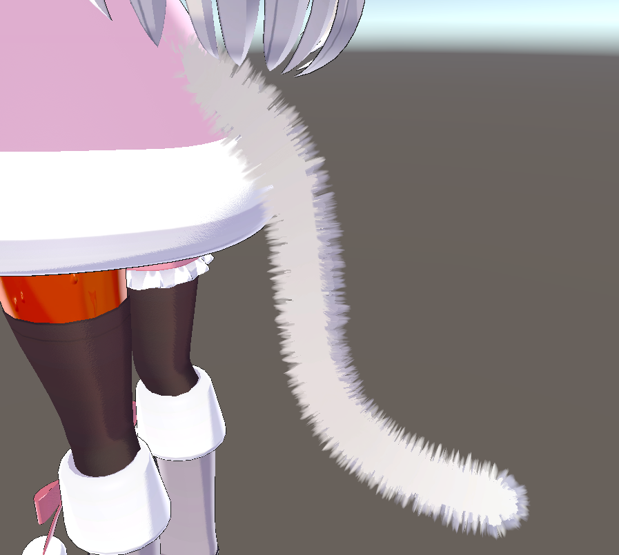
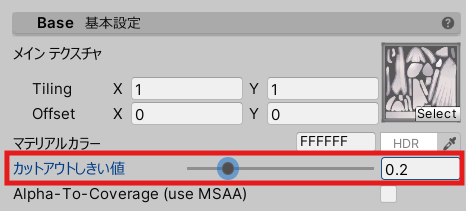
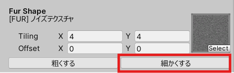
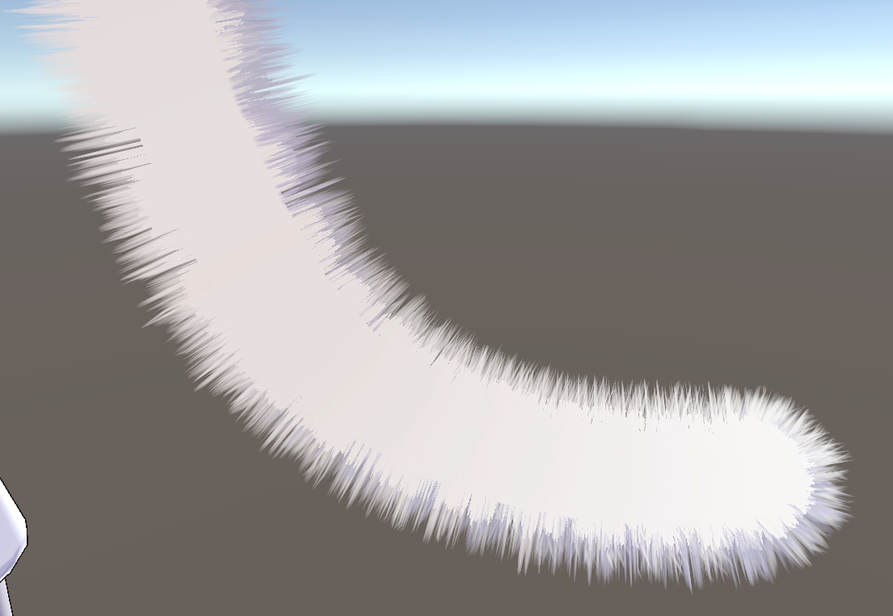
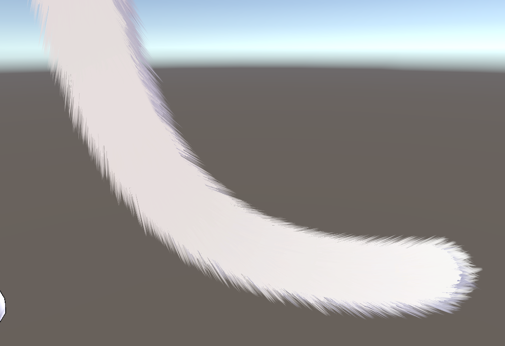
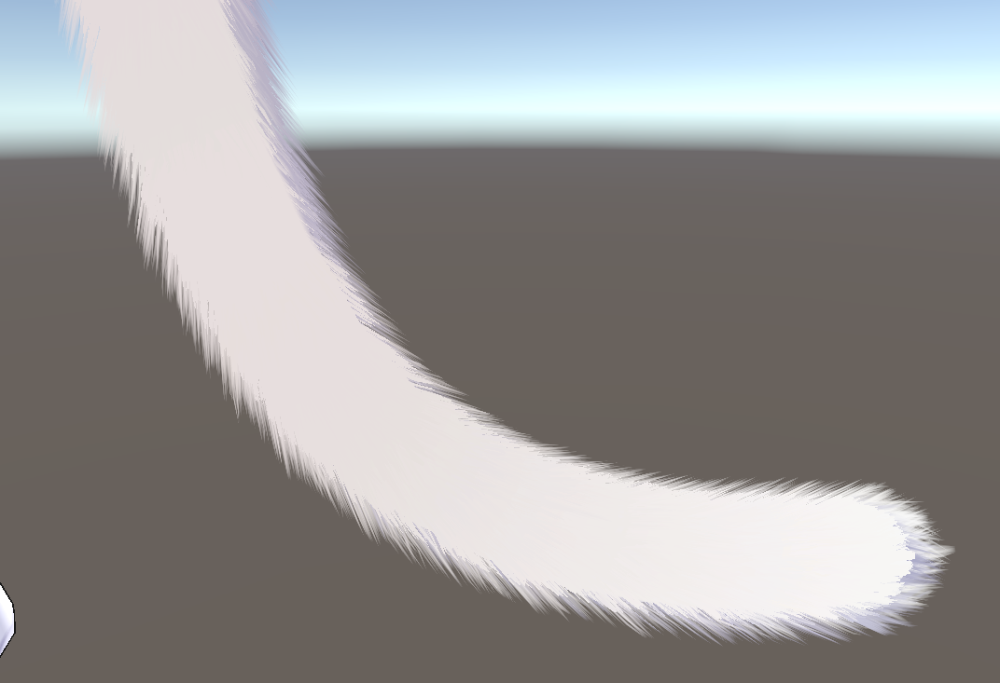

# UnlitWF/FakeFur Manual

UnlitWF/FakeFur は、UnToon をベースにしたファーシェーダです。
このページでは UnlitWF/FakeFur の設定方法について説明します。

## General

### カスタムインスペクタの日本語化 {#l10n}

インスペクタの最下部に `Editor language` の設定があります。『日本語』にすると設定項目名が日本語化されます。
これはUnityEditorで共通の設定のため、どこかひとつのマテリアルで設定されると他マテリアルでも設定が引き継がれます。

### バリアントの切り替え {#Variants}

インスペクタ最上段に、現在使用しているシェーダの説明が表示されます。

- `Family` からシェーダの系列を切り替えることができます。`UnToon`, `FakeFur`, `Gem`, `Grass`, `Water` などに切り替えることができます。
- `Variant` からシェーダのタイプを切り替えることができます。Outline や Mobile などに切り替えることができます。
- `RenderType` から描画モードを切り替えることができます。Opaque や Transparent などに切り替えることができます。

## Base 基本設定 {#Base}

- インスペクタ最上段に `メインテクスチャ` `マテリアルカラー` の設定項目があります。
- ファーをカットアウト描画するシェーダでは、ここに `カットアウトしきい値` も現れます。

## Fake Fur ファー {#FakeFur}

ファーについて設定します。

- Fur Shape
  - `高さ` `ファーの枚数` にてファーの密度を決めることができます。
    - メッシュの頂点数にも因りますが、大きな値を設定するとFPSの低下を招くことがあります。
    - 密度が足りない場合は `方向` を調整してファーを横に寝かせることで少ない密度でもフサフサ感を保つことができます。
  - `ノイズテクスチャ` でファー形状を制御することができます。初期値としてノイズテクスチャをそのまま使用して構いません。
    - `細かくする` ボタンを何度か押してください。ファーが細かくなるとフサフサ感が増します。
  - `方向` の値を調整することで、ファーを一定方向に傾けることができます。
    - XやYの値が大きければ大きいほど傾きます。ファーが直立した状態よりも傾けた状態のほうがフサフサ感が増します。XやYを±2くらいに設定するとよいです。
    - 内部的には、メッシュ法線ベクトルを方向(0, 0, 1)として、`方向` に設定したベクトル方向に傾けます。例えば (1, 0, 1) ではタンジェントプラスの方向に45度傾けます。
  - `方向のランダム化` を用いると、揃った毛先にバラ付きを与えることができます。0 よりは多少大きな値にしたほうが自然な毛並みになります。
  - `ノーマルマップ` は、ファー方向の基準となるメッシュ法線を変化させるノーマルマップを設定することができます。
- Fur Color
  - `影の強さ` `色調整(根元)` `色調整(先端)` にてファーの色を変化させることができます。
- Fur Mask Texture
  - `マスクテクスチャ` にて、ファーの高さを制御することができます。黒が高さ0、白が高さ100%です。
  - ファー部分とファー以外の部分は、マスクテクスチャで塗り分けるのではなくマテリアルを分割することを推奨します。FakeFurシェーダが描画する頂点数をなるべく少なくしてください。

## 簡易設定手順

Family を `FakeFur` に変更します。

毛が極端に少ない、または多い場合は `カットアウトしきい値` を見直してみてください。

毛を細くします。ノイズテクスチャの `細かくする` を押してください。

`方向` のXYを調整します。

`方向のランダム化` を調整します。

