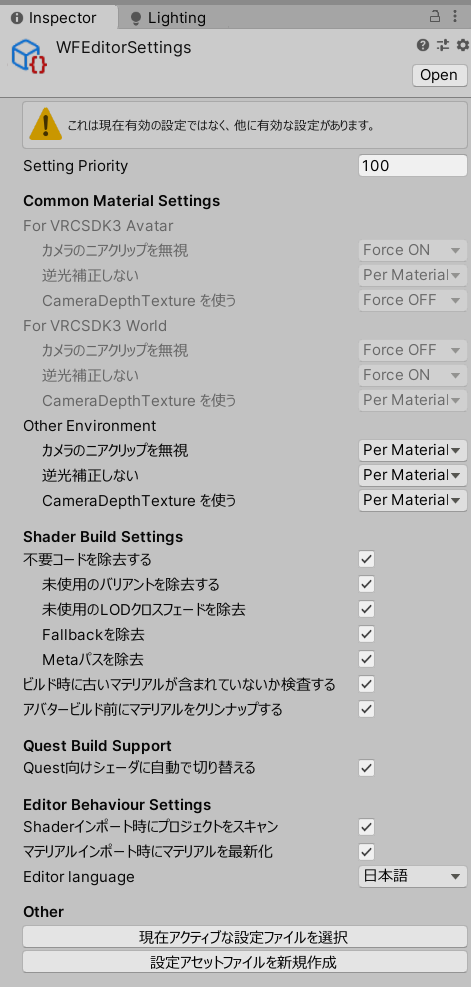
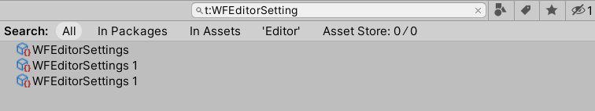

# UnlitWFの共通設定

## カスタムインスペクタの日本語化 {#l10n}

インスペクタの最下部に `Editor language` の設定があります。『日本語』にすると設定項目名が日本語化されます。

- `Editor language` は使用しているPC内で共通の設定のため、どこかひとつのマテリアルで設定されると他プロジェクトの他マテリアルでも設定が引き継がれます。
- 使用しているPCで最初に UnlitWF をインポートした際は、OSのロケール設定を元に日本語にするかどうか決定します。インポート後に切り替えるときに使用してください。

## バリアントの切り替え {#Variants}

インスペクタ最上段に、現在使用しているシェーダの説明が表示されます。

- `Family` からシェーダの系列を切り替えることができます。`UnToon`, `FakeFur`, `Gem`, `Grass`, `Water` などに切り替えることができます。
- `Variant` からシェーダのタイプを切り替えることができます。Outline や Mobile などに切り替えることができます。
- `RenderType` から描画モードを切り替えることができます。Opaque や Transparent などに切り替えることができます。

## マテリアルオプション {#MaterialOptions}

マテリアルに対する設定を行います。これらの項目は UnlitWF 以外のマテリアルにもある共通設定項目です。

- `Render Queue` では RenderQueue値を設定します。Standardシェーダの同名項目と同じ機能です。
- `Enable GPU Instancing` を有効にすると、描画負荷が低減される場合があります。Standardシェーダの同名項目と同じ機能です。
- `Double Sided Global Illumination` を有効にすると、ライトベイク時に両面メッシュとして扱われます。Standardシェーダの同名項目と同じ機能です。
- `VRC Fallback` では、VRChat のアバターシェーダフォールバック機能によって変換される先のシェーダを指定できます。

## ユーティリティ {#Utility}

インスペクタの最下部にあります。インスペクタの日本語化もここから行います。

- `テンプレートから適用` は、現在のマテリアルにテンプレートの設定を適用します。必要に応じてシェーダとバリアントが変更されることもあります。
  - 新しくテンプレートを作成する場合は `テンプレートとして保存` を選んでください。場所は Assets フォルダ配下の任意の場所に保存できます。保存されたものはリストアップされます。
- `メインテクスチャのベイク` は、現在のマテリアルに設定されている色変更関連の設定をメインテクスチャに反映した新しいテクスチャを作成することができます。
  - 色変更関連の設定がない場合(ベイクが不要な場合)は **何も動作しません。**
  - ベイクすることで見た目が変化してしまう場合はプロンプトが表示されます。
- `マテリアルの不要データを削除` を押すと、現在のマテリアルにある未使用の値をクリアします。

## WFEditorSetting {#WFEditorSetting}

その他の設定項目は WFEditorSetting アセットにあります。

WFEditorSetting アセットはプロジェクトに格納されているアセットのうち、Setting Priority が最も小さいものが使用されます。  
アセットを検索するときは `t:WFEditorSetting` で検索してください。

In Assets ではなく In Packages に入っている場合があります。『All』で表示するとプロジェクト内の全ての WFEditorSetting アセットを表示することができます。  
また、インスペクタ最下部の「現在アクティブな設定ファイルを選択」ボタンを押すと、有効になっている WFEditorSetting アセットを直接表示させることも可能です。

### Common Material Settings {#WFEditorSetting-CommonMaterialSettings}

UnlitWFマテリアル共通の設定項目です。  
`Force ON` or `Force OFF` に設定すると、ビルド時にマテリアルの指定の値をオン or オフに強制的に設定します。またマテリアルのインスペクタに設定項目は表示されません。  
`Per Material` に設定すると、マテリアルごとに設定を変更することができます。この場合はマテリアルのインスペクタに設定項目が表示されます。

設定項目は『VRCSDK3アバター』『VRCSDK3ワールド』『その他の環境』向けに分かれています。それぞれの環境での推奨値が初期値として設定されています。

:::info
初期値は次の通りです。

- VRCSDK3 アバター
  - カメラのニアクリップを無視 = Force ON
  - CameraDepthTextureを使う = Force OFF
  - VRC LightVolumesを使う = Force ON
- VRCSDK3 ワールド
  - カメラのニアクリップを無視 = Force OFF
  - 逆光補正しない = Force ON

上記以外の項目は Per Material に設定されています。
:::

### Shader Build Settings {#WFEditorSetting-ShaderBuildSettings}

UnlitWFシェーダをビルドするときの挙動を制御します。

- 不要コードを除去する
  - シェーダ内の使われていないコードをビルド時に自動的に除去します。ビルド時間が短縮され、ビルドサイズも削減されます。
- ビルド時に古いマテリアルが含まれていないか検査する
  - UnlitWFの古いバージョンで作られたマテリアルが最新化されずに残っている場合、ビルド前に検査してコンソールに警告を表示します。
- アバタービルド前にマテリアルをクリンナップする。
  - (VRCSDK3アバター環境のみ) ビルド前にマテリアルから不要な値や未使用のテクスチャ参照を削除します。ビルドサイズが削減されます。

初期値は全てオンです。これによりビルド時間の短縮とビルドサイズの削減が行われます。

### Quest Build Support {#WFEditorSetting-QuestBuildSupport}

(VRCSDK3ワールド環境のみ) Android環境でビルドしたとき、UnlitWFシェーダを自動的にモバイル環境で動くバリアントに差し替えます。  
これにより一部の描画処理が無効化されるものの、Android環境で正常動作するシェーダがビルドに乗ります。  

オフにした場合は変換処理が省略され、Android環境で正常動作しないバリアントがビルドに含まれる可能性があります。  
なお、オンオフどちらの場合でも、Android環境でサポートされないバリアントがビルドに含まれた場合には、コンソールに警告が表示されます。

### Editor Behaviour Settings {#WFEditorSetting-EditorBehaviourSettings}

UnityEditor内でのツールの挙動を設定します。

- Shaderインポート時にプロジェクトをスキャン
  - UnlitWFシェーダのバージョンアップ等によりシェーダがインポートされたことをトリガーとして、プロジェクト内のマテリアルをスキャンし、古いバージョンで作成されたマテリアルを最新化します。
- マテリアルインポート時にマテリアルを最新化
  - マテリアルがインポートされたとき、古いバージョンで作成されたマテリアルを自動で最新化します。
- Editor language
  - 言語設定です。[カスタムインスペクタの日本語化](#l10n) と同じ設定項目です。

