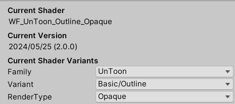
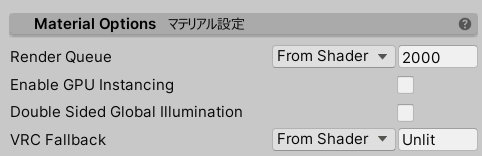

# UnlitWFの共通設定

## カスタムインスペクタの日本語化 {#l10n}

インスペクタの最下部に `Editor language` の設定があります。『日本語』にすると設定項目名が日本語化されます。

- `Editor language` は使用しているPC内で共通の設定のため、どこかひとつのマテリアルで設定されると他プロジェクトの他マテリアルでも設定が引き継がれます。
- 使用しているPCで最初に UnlitWF をインポートした際は、OSのロケール設定を元に日本語にするかどうか決定します。インポート後に切り替えるときに使用してください。

## バリアントの切り替え {#Variants}

インスペクタ最上段に、現在使用しているシェーダの説明が表示されます。

- `Family` からシェーダの系列を切り替えることができます。`UnToon`, `FakeFur`, `Gem`, `Grass`, `Water` などに切り替えることができます。
- `Variant` からシェーダのタイプを切り替えることができます。Outline や Mobile などに切り替えることができます。
- `RenderType` から描画モードを切り替えることができます。Opaque や Transparent などに切り替えることができます。

## マテリアルオプション {#MaterialOptions}

マテリアルに対する設定を行います。これらの項目は UnlitWF 以外のマテリアルにもある共通設定項目です。

- `Render Queue` では RenderQueue値を設定します。Standardシェーダの同名項目と同じ機能です。
- `Enable GPU Instancing` を有効にすると、描画負荷が低減される場合があります。Standardシェーダの同名項目と同じ機能です。
- `Double Sided Global Illumination` を有効にすると、ライトベイク時に両面メッシュとして扱われます。Standardシェーダの同名項目と同じ機能です。
- `VRC Fallback` では、VRChat のアバターシェーダフォールバック機能によって変換される先のシェーダを指定できます。

## ユーティリティ {#Utility}

インスペクタの最下部にあります。インスペクタの日本語化もここから行います。

- `テンプレートから適用` は、現在のマテリアルにテンプレートの設定を適用します。必要に応じてシェーダとバリアントが変更されることもあります。
  - 新しくテンプレートを作成する場合は `テンプレートとして保存` を選んでください。場所は Assets フォルダ配下の任意の場所に保存できます。保存されたものはリストアップされます。
- `メインテクスチャのベイク` は、現在のマテリアルに設定されている色変更関連の設定をメインテクスチャに反映した新しいテクスチャを作成することができます。
  - 色変更関連の設定がない場合(ベイクが不要な場合)は **何も動作しません。**
  - ベイクすることで見た目が変化してしまう場合はプロンプトが表示されます。
- `マテリアルの不要データを削除` を押すと、現在のマテリアルにある未使用の値をクリアします。

