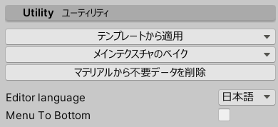

# UnlitWFの共通設定

## カスタムインスペクタの日本語化 {#l10n}

インスペクタの最下部に `Editor language` の設定があります。『日本語』にすると設定項目名が日本語化されます。

- `Editor language` は使用しているPC内で共通の設定のため、どこかひとつのマテリアルで設定されると他プロジェクトの他マテリアルでも設定が引き継がれます。
- 使用しているPCで最初に UnlitWF をインポートした際は、OSのロケール設定を元に日本語にするかどうか決定します。インポート後に切り替えるときに使用してください。

## バリアントの切り替え {#Variants}

インスペクタ最上段に、現在使用しているシェーダの説明が表示されます。

- `Family` からシェーダの系列を切り替えることができます。`UnToon`, `FakeFur`, `Gem`, `Grass`, `Water` などに切り替えることができます。
- `Variant` からシェーダのタイプを切り替えることができます。Outline や Mobile などに切り替えることができます。
- `RenderType` から描画モードを切り替えることができます。Opaque や Transparent などに切り替えることができます。

## マテリアルオプション {#MaterialOptions}

マテリアルに対する設定を行います。これらの項目は UnlitWF 以外のマテリアルにもある共通設定項目です。

- `Render Queue` では RenderQueue値を設定します。Standardシェーダの同名項目と同じ機能です。
- `Enable GPU Instancing` を有効にすると、描画負荷が低減される場合があります。Standardシェーダの同名項目と同じ機能です。
- `Double Sided Global Illumination` を有効にすると、ライトベイク時に両面メッシュとして扱われます。Standardシェーダの同名項目と同じ機能です。
- `VRC Fallback` では、VRChat のアバターシェーダフォールバック機能によって変換される先のシェーダを指定できます。
