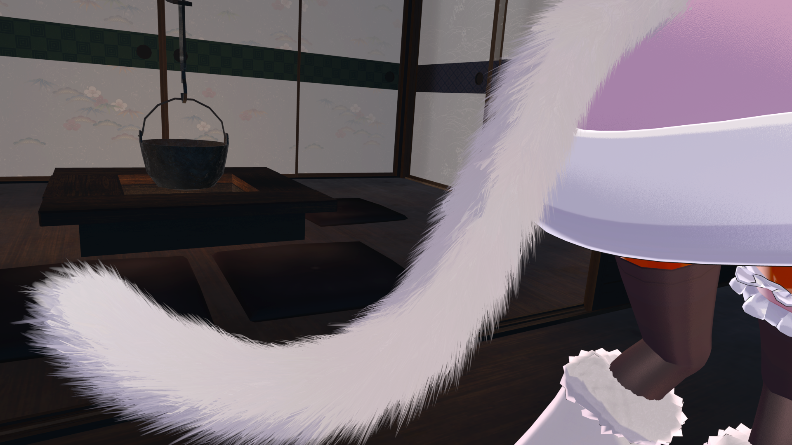
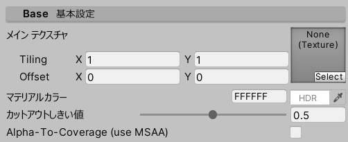
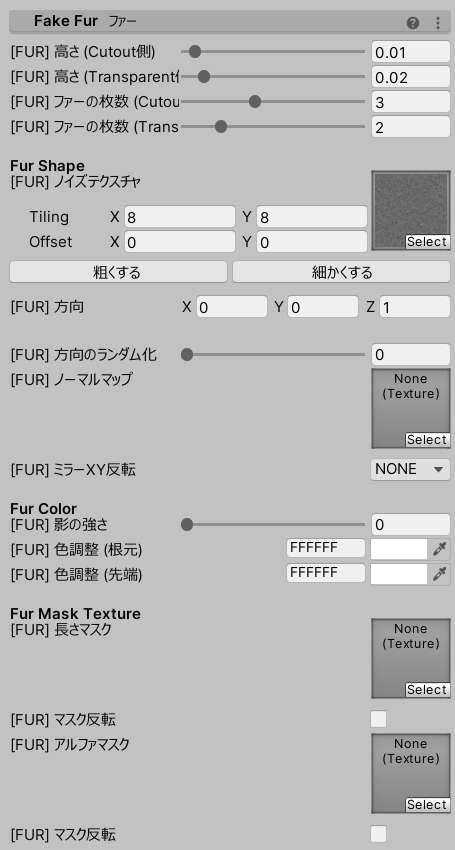
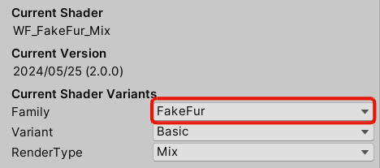
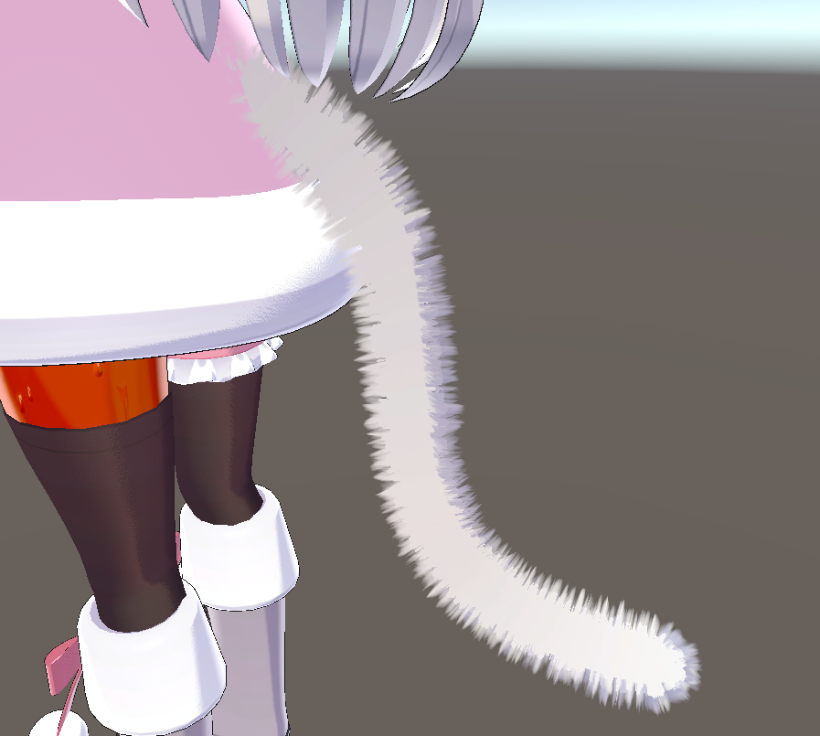
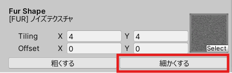
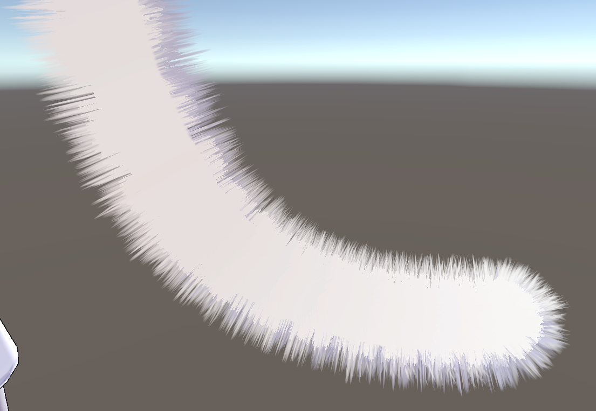
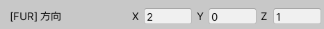
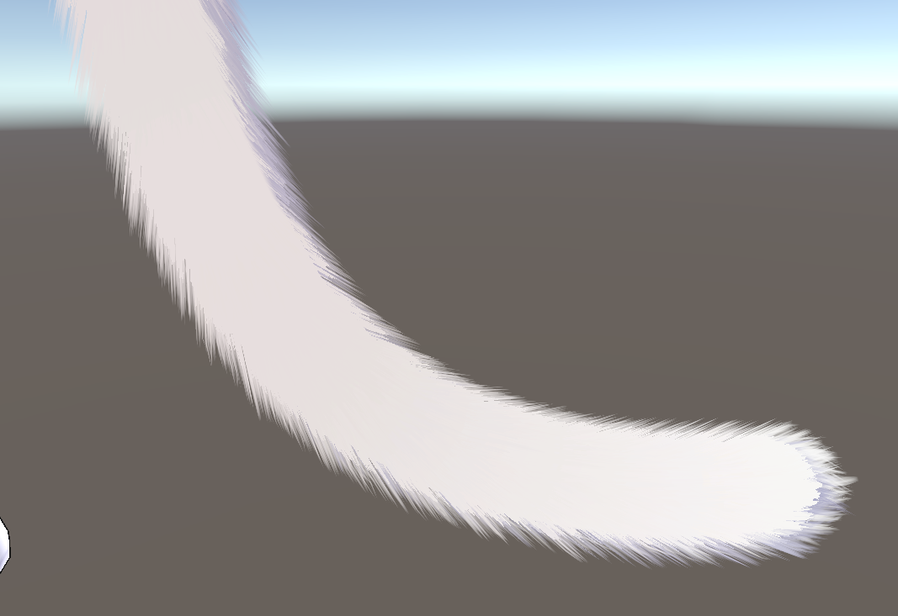
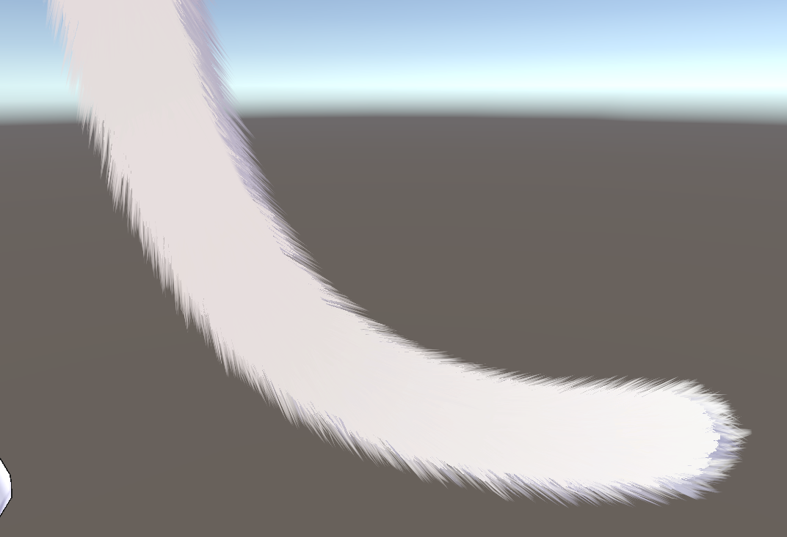

# UnlitWF/FakeFur

UnlitWF/FakeFur は、UnToon をベースにしたファーシェーダです。
このページでは UnlitWF/FakeFur の設定方法について説明します。

----

## 設定項目の説明

### Base 基本設定 {#Base}

- インスペクタ最上段に `メインテクスチャ` `マテリアルカラー` の設定項目があります。
- ファーをカットアウト描画するシェーダでは、ここに `カットアウトしきい値` も現れます。

### Fake Fur ファー {#FakeFur}

ファーについて設定します。

- Fur Shape
  - `高さ` `ファーの枚数` にてファーの密度を決めることができます。
    - メッシュの頂点数にも因りますが、大きな値を設定するとFPSの低下を招くことがあります。
    - 密度が足りない場合は `方向` を調整してファーを横に寝かせることで少ない密度でもフサフサ感を保つことができます。
  - `ノイズテクスチャ` でファー形状を制御することができます。初期値としてノイズテクスチャをそのまま使用して構いません。
    - `細かくする` ボタンを何度か押してください。ファーが細かくなるとフサフサ感が増します。
  - `方向` の値を調整することで、ファーを一定方向に傾けることができます。
    - XやYの値が大きければ大きいほど傾きます。ファーが直立した状態よりも傾けた状態のほうがフサフサ感が増します。XやYを±2くらいに設定するとよいです。
    - 内部的には、メッシュ法線ベクトルを方向(0, 0, 1)として、`方向` に設定したベクトル方向に傾けます。例えば (1, 0, 1) ではタンジェントプラスの方向に45度傾けます。
  - `方向のランダム化` を用いると、揃った毛先にバラ付きを与えることができます。0 よりは多少大きな値にしたほうが自然な毛並みになります。
  - `ノーマルマップ` は、ファー方向の基準となるメッシュ法線を変化させるノーマルマップを設定することができます。
- Fur Color
  - `影の強さ` `色調整(根元)` `色調整(先端)` にてファーの色を変化させることができます。
- Fur Mask Texture
  - ファー範囲の制御のため `長さマスク` と `アルファマスク` の2つを使用することができます。
  - `長さマスク` はファー長さに直結するマスクテクスチャです。黒が長さ0%、白が長さ100%として機能します。
    - 長さマスクで制御するほうが軽量になるよう実装されています。
  - `アルファマスク` はファーの透明度に直結するマスクテクスチャです。黒が完全透明、白が不透明度100%として機能します。
    - アルファマスクのほうが小さな領域を制御できますが、長さマスクよりも高負荷です。
  - マスクで制御するよりもマテリアルを分割したほうが軽量になります。ファーとそれ以外が混在したメッシュの場合はマテリアル分割を推奨します。

----

## 簡易設定手順

Family を `FakeFur` に変更します。

毛が極端に少ない、または多い場合は `カットアウトしきい値` を見直してみてください。

毛を細くします。ノイズテクスチャの `細かくする` を押してください。

`方向` のXYを調整します。

`方向のランダム化` を調整します。

