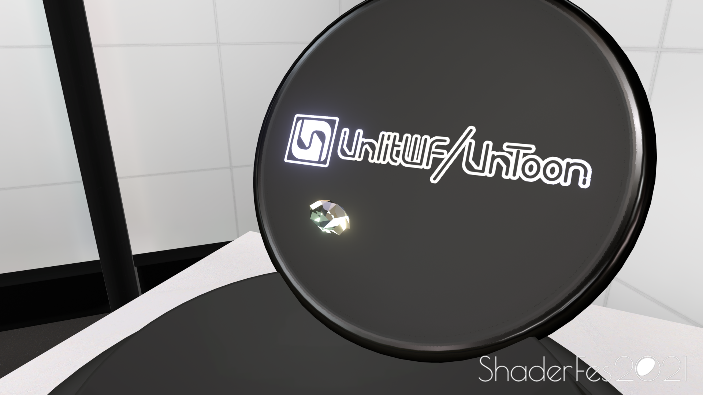
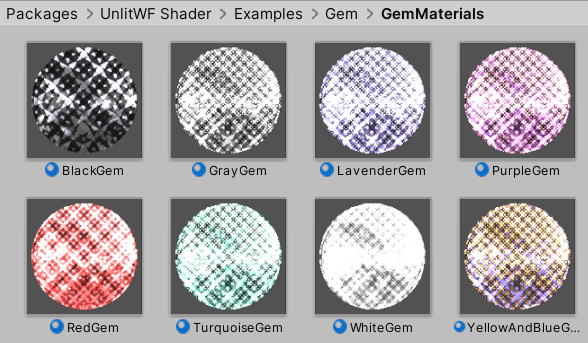
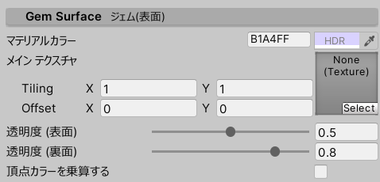
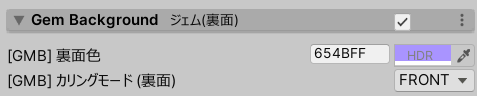
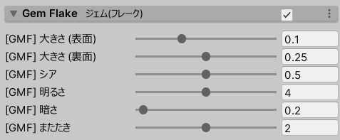
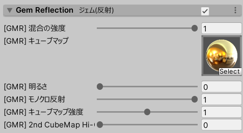

# UnlitWF/Gem

UnlitWF/Gem は、UnToon をベースにしたジェム(宝石)シェーダです。
このページでは UnlitWF/Gem の設定方法について説明します。

## サンプルマテリアル

設定済みマテリアルが `/Examples/Gem/GemMaterials` に収録されています。
複製してご利用ください。

----

## 設定項目の説明

### Gem Surface ジェム(表面) {#GemSurface}

- マテリアルカラーやメインテクスチャを設定します。
- Transparent シェーダでは `透明度(表面)` と `透明度(裏面)` にて透明度を微調整できます。

### Gem Background ジェム(裏面) {#GemBackground}

- 裏面側の色とカリングモードを、表面とは別に指定できます。

### Gem Flake ジェム(フレーク) {#GemFlake}

- 宝石に特徴的な反射模様を描画に追加します。

### Gem Reflection ジェム(リフレクション) {#GemReflection}

- キューブマップからの反射を描画に追加します。
