# UnlitWF/UnToon

UnlitWF/UnToon は、Unlit に様々な描画効果を追加する発想で設計された Unity/VRChat 想定の Toon Shader です。
このページでは UnlitWF/UnToon の設定について解説します。
内容は最新のリリースに基づいて記載しますが、必ずしも最新の状態を反映しているわけではなく細部に違いがある場合もあります。ご了承ください。

アバターやワールドにUnlitWF/UnToonを使用してみたサンプルイメージです。Skybox以外は全てUnlitWFで描画しています。

----

## 設定項目の説明

### Base 基本設定 {#Base}

インスペクタ最上段に `メインテクスチャ` `マテリアルカラー` の設定項目があります。
Culling を操作できるバリアントでは `カリングモード` も現れます。`カリングモード` のないバリアントは常に Cull OFF で描画されます。

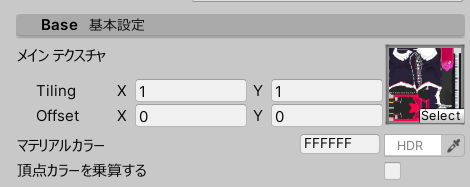

### Transparent Alpha 透過 {#TransparentAlpha}

透過についての設定です。

- `アルファソース` では、透過に使用するAlpha値の参照先を指定できます。
  - MAIN_TEX_ALPHA は `Main Texture` および `Color` のAlpha値で透過します。
  - MASK_TEX_RED は `アルファマスク` のRチャンネルを参照します。
  - MASK_TEX_ALPHA は `アルファマスク` のAチャネルを参照します。
- `アルファ強度` は、透過具合の調整用です。0で透明、値が大きくなるほど不透明に近くなります。 Min-Maxスライダーを用いて、透過具合の上限値と下限値をそれぞれ調整できます。
- `フレネル強度` は、浅い角度で面をみたときの透過具合を調整します。0では調整なし、値が大きくなるほど浅い角度で不透明に近くなります。
- `ZWrite` は、描画時の深度バッファへの書き込みを制御します。`OFF` では書き込みなし、`ON` では書き込みありです。 半透明を2パスで描画するシェーダでは `TwoSided` の選択肢も現れます。この場合 `ON` は表面のみ書き込みあり、`TwoSided` は表面・裏面ともに書き込みありです。

### Outline アウトライン {#Outline}

アウトラインについての設定です。

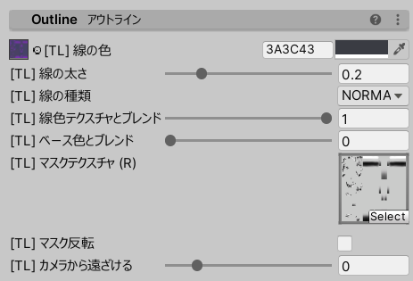

- アウトラインの描画方法を `線の種類` から選択できます。
  - **NORMAL** メッシュの法線方向に沿ってアウトラインを膨らませる、通常の描画方法です。
  - **EDGE** ハードエッジに強いアウトラインの描画方法です。
- アウトラインの色を `線色テクスチャ` から指定することもできます(UVはMainTextureと同じ)。ブレンド強度は `線色テクスチャとブレンド` にて調整してください。
- `カメラから遠ざける` を調整することで、アウトラインのメッシュを近づけたり遠ざけたりすることができます。

### MainTexture 2nd メインテクスチャ2nd {#MainTex2nd}

メインテクスチャに2枚目のテクスチャを重ねて描画します。

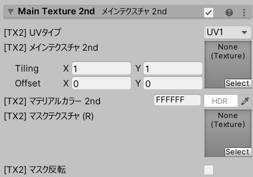

- `UVタイプ` では UV1 と UV2 のどちらで重ねるかを指定できます。
- 重ねる強さはメインテクスチャ2ndあるいはマテリアルカラー2ndのアルファ値が使用されます。アルファ `1.0` にて不透明度100%となり、アルファ `0.0` では2ndメインテクスチャは描画されません。
- 重ねる範囲をマスクテクスチャにて指定できます。

### BackFace Texture 裏面テクスチャ {#BackFaceTexture}

裏面に MainTex とは異なる色・テクスチャを使用する時に設定します。

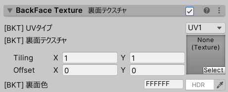

- `UVタイプ` では UV1 と UV2 のどちらで重ねるかを指定できます。

### Gradient Map グラデーションマップ {#GradientMap}

グラデーションマップ用テクスチャをもとに、色をカスタマイズします。

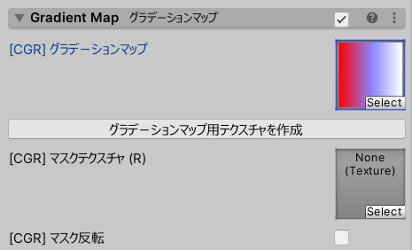

- `グラデーションマップ用テクスチャを作成` ボタンから、専用のテクスチャを作成することができます。 

  - グラデーションを編集し `プレビュー` ボタンを押すと、編集内容が一時的に反映されます。この反映は一時的なものなのでマテリアルには保存されずクリアされます。
  - `保存` ボタンを押すとグラデーションマップ用テクスチャを保存することができます。

### Color Change 色変更 {#ColorChange}

HSVスライダーをもとに、色をカスタマイズします。

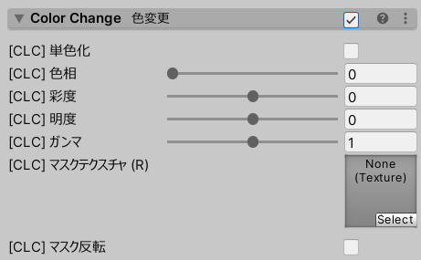

- `色相` `彩度` `明度` のスライダーにて色を調整できます。
- `ガンマ` を操作するとガンマ補正が掛かります。値が大きくなるほど暗くなり、小さくなるほど明るくなります。
- `単色化` にチェックを入れると、上記の色調整を行う前に色相を赤に揃えるフィルタが追加されます。

### Normal Map ノーマルマップ {#NormalMap}

ノーマルマップについての設定です。ここではメッシュ全体の凹凸を制御します。

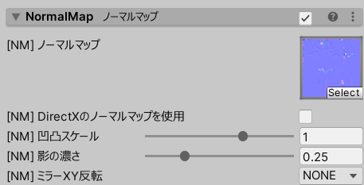

- `影の濃さ` ではノーマルマップによる陰影の濃さを設定できます。0 は影が付きませんが、0 であっても凹凸の情報は Metallic, Matcap, ToonShade 等に伝達され描画されます。
- `凹凸スケール` は `-1` から `2` まで調整することができます。
- `ミラーXY反転` ではUVが反転している箇所 (ミラーモディファイアを使用した箇所など) にて NormalMap を反転させるオプションです。
- `DirectXのノーマルマップを使用` をチェックすると、通常UnityのノーマルマップはOpenGL形式のところ、DirectXのノーマルマップを使用するよう変換処理が行われます。

### Detail Normal Map ディテールノーマルマップ {#DetailNormalMap}

追加のノーマルマップを利用するときの設定です。Normal Map よりも細かい範囲の、メッシュ表面の微細な凹凸を制御します。
DetailNormalMap は NormalMap とは異なり、陰影を直接描く機能はありません。凹凸情報は Metallic, Matcap, ToonShade 等に伝達され描画されます。

- `ミラーXY反転` ではUVが反転している箇所 (ミラーモディファイアを使用した箇所など) にて NormalMap を反転させるオプションです。この設定は NormalMap 側と連動しています。
- 2ndノーマルマップは効果範囲をマスクテクスチャで指定することができます。`2ndノーマルのマスク` にマスクを設定してください。

### Metallic メタリック {#Metallic}

金属表現についての設定です。Reflection と Specular の設定ができます。

- `メタリック強度` は 0 が非金属、1 が金属となるパラメータです。Standard Shader での Metallic パラメータに相当します。
- `滑らかさ` は 0 が荒い、1 が滑らかとなるパラメータです。Standard Shader での Smoothness パラメータに相当します。UnToon では Reflection 用と Specular 用にそれぞれの Smoothness を設定できます。
- `MetallicSmoothnessマップ` は Standard Shader でも用いられるメタリックマップ(RチャンネルにMetallic、AチャンネルにSmoothness)を指定できます。
- `Roughnessマップ` は、Standard Shader (Autodesk Interactive) でも用いられるラフネスマップを指定できます。Roughnessマップと MetallicSmoothnessマップは併用可能で、Autodesk Interactive で使用できる MetallicMap + RoughnessMap を流用できます。
- Metallic Secondary では、ReflectionProbeからの環境マップではなく独自のCubeMapを設定できます。
  - OFF では `キューブマップ` を使いません。
  - ADDITION では環境マップと `キューブマップ` を加算合成して使用します。
  - ONLY_SECOND_MAP では、環境マップは使用せず `キューブマップ` のみを使用します。
- `モノクロ反射` を 0 にすると、環境マップ/キューブマップの明度のみ反映し、色彩は Albedo をそのまま用います。1 にすると環境マップ/キューブマップの色彩をブレンドした色が反射光となります。

### Light Matcap マットキャップ {#LightMatcap}

Matcapについての設定です。UnToon では最大2枚のMatcapを使用できます。また Variant を PowerCap にすると最大8枚のMatcapを使用できます。

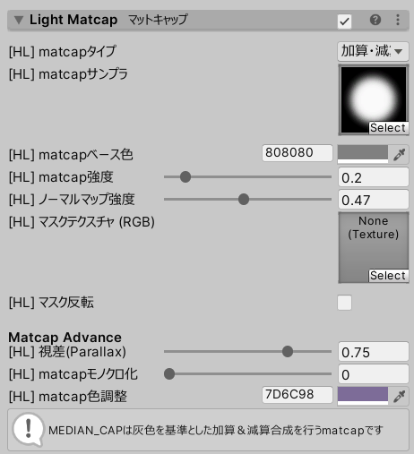

- `matcapタイプ` から Matcap の合成モードを選んでください。以下の3種類を使うことができます。
  - `加算・減算` 加算合成と減算合成を行います。灰色が不動点です。
  - `加算` 加算合成を行います。黒色が不動点です。
  - `乗算` 乗算合成を行います。白色が不動点です。
- matcap画像は `matcapサンプラ` にて指定してください。
- `matcap色調整` では、matcapサンプラの色調を調整できます。
- `視差(Parallax)` は matcap の視差について調整できます。1 にすると右目左目で光沢の位置が変化します。0 にすると右目左目で位置が変化しません。 金属光沢を matcap で表現する時は大きめの値に、影を matcap で表現する時は小さめの値にすることがおすすめです。シングルパスステレオではない場合は無効です。

### Lame ラメ {#Lame}

表面にラメ(Lamé, 金属粉)を追加します。

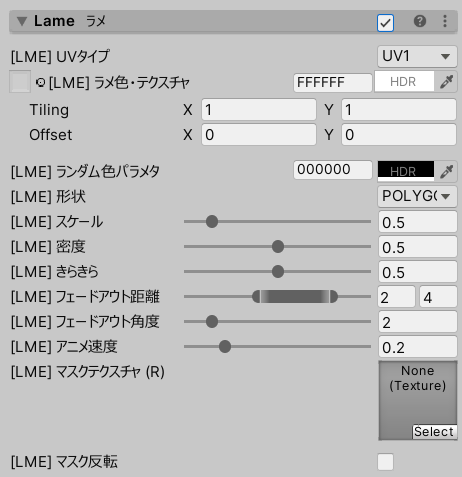

- `ラメ色` ではラメの基本色を指定します。実際に描画されるラメの色は `ラメ色.RGB ± ランダム色パラメタ.RGB` で、さらにこれに強度を考慮した色が画面に描画されます。
- `スケール` ではラメの大きさ、`密度` はラメの量を調整できます。
- `きらきら` を強くすると、ラメの光量がより強まります。
- `距離フェード開始` は、ラメが見える最大距離を指定します。カメラとメッシュの距離が指定された距離以上になるとラメの効果は弱まり、最終的には不可視になります。
- `スポットフェード強度` は、ラメの見える範囲を指定します。強くするとカメラに対して正面を向いたラメのみが見えるようになります。
- `アニメ速度` は、ラメの明滅速度を指定します。値が大きいほど周期が短くなります。値が `0` のとき、明滅せず常に可視になります。

### ToonShade トゥーン影 {#ToonShade}

階調影についての設定です。

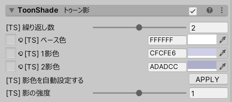

- UnToon の ToonShade は、`ベース色` に指定された色が `1影色` および `2影色` となるように描画されます。
- `ベース色` に基準色をスポイトし `影色を自動設定する` の APPLY ボタンを押すと、ベース色を元に1影色および2影色を自動で設定します。
- `アンチシャドウマスク` は、影のかかりにくい部分を白色、そうではない部分を黒色としたマスクテクスチャを指定します。
  - もっぱらアバターの顔に影をかけないよう指定するためのマスクテクスチャです。
  - 顔マテリアルが他と独立しているのであれば、テクスチャは指定せず `マスク反転` をチェックするだけでも効果があります。(テクスチャ未指定=黒色の状態にてマスク反転するので、全域が白色となり影がかかりにくくなる)

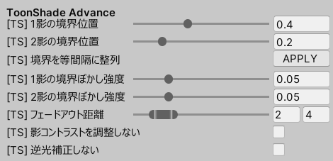

ToonShade の詳細を ToonShade Advance から設定できます。
1影2影の位置、および境界ぼかし強度を調整可能です。

### RimLight リムライト {#RimLight}

リムライトの設定です。

- `混合タイプ` を `加算・減算`, `加算`, `アルファ合成`, `乗算` から選ぶことができます。
- `ベースカラーをリムライト色に混合` をチェックすると、ベースカラー(色変更までを反映した基本色)をリムライト色に乗算することができます。
- `マスクテクスチャ` には、リムライトを無効にする範囲を黒、有効にする範囲を白にしたマスクテクスチャを指定します。 フルカラーテクスチャが利用可能です。リムライト色を指定することもできます。
- リムライトの太さは `幅` にて調整できます。方向によって変化させるときはさらに `幅(上)` `幅(横)` `幅(下)` で変化させることもできます。

### RimShadow リムシャドウ {#RimShadow}

リムシャドウの設定です。加算合成を行うリムライトに対して、乗算合成を行うものがリムシャドウです。

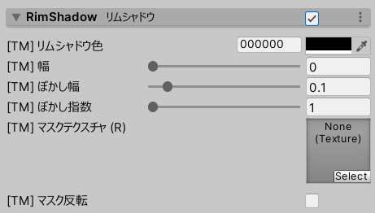

- `マスクテクスチャ` には、リムシャドウを無効にする範囲を黒、有効にする範囲を白にしたマスクテクスチャを指定します。
- リムシャドウの太さは `幅` にて調整できます。方向によって変化させるときはさらに `幅(上)` `幅(横)` `幅(下)` で変化させることもできます。

### Overlay Texture オーバーレイテクスチャ {#OverlayTexture}

質感を微調整するテクスチャを設定することができます。Detail Albedo やデカールテクスチャなどの詳細マップはここで設定してください。

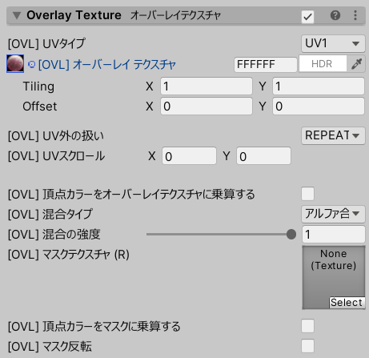

- `オーバーレイテクスチャ` にテクスチャを設定してください。Tiling と Offset を MainTexture とは別に指定できます。
- `UVタイプ` にて Decal Texture の座標系を選ぶことができます。
  - UV1: MainTextureと同じUV座標系で描画します。
  - UV2: UV2の座標系で描画します。
  - SKYBOX: SkyBoxのような天球座標系で描画します。オーバーレイテクスチャは Latitude-Longitude 型レイアウトとして扱われます。
  - MATCAP: matcap 用の座標系です。オーバーレイテクスチャを matcap として扱います。
  - ANGEL_RING: エンジェルリング matcap 用の座標系です。Y座標を `UV2.y` から参照するUTS互換形式です。`UV2.y` との混合強度は `Custom Parameter 1` で指定します。
- `混合タイプ` では、オーバーレイテクスチャのブレンド方法を指定できます。
  - ALPHA: アルファブレンド
  - ADD: 加算合成 `base.rgb + decal.rgb`
  - MUL: 乗算合成 `base.rgb * decal.rgb`
  - ADD_AND_SUB: 加算合成の亜種で、零点が黒ではなく灰色のものです。 `base.rgb + decal.rgb - GRAY.rgb`
  - SCREEN: スクリーン合成 `1 - (1 - base,rgb) * (1 - decal.rgb)`
  - OVERLAY: オーバーレイ合成 `lerp(2 * base.rgb * decal.rgb, 1 - 2 * (1 - base.rgb) * (1 - decal.rgb), step(calcBrightness(base.rgb), 0.5))`
  - HARD_LIGHT: ハードライト合成 `lerp(2 * base.rgb * decal.rgb, 1 - 2 * (1 - base.rgb) * (1 - decal.rgb), step(calcBrightness(decal.rgb), 0.5))`
- `UV外の扱い` ではオーバーレイテクスチャのタイリングについて指定できます。`REPEAT` は繰り返し、`CLIP` はUV外を描画しません。 デカールなどのワンポイントとするテクスチャは CLIP とすると便利です。

### Distance Fade 距離フェード {#DistanceFade}

メッシュにカメラを近づけたときの塗りつぶし色を指定します。

- `フェード距離` にて発動する距離を指定します。フェード距離以下にカメラが近づくと強度max、フェード距離以上にカメラが離れると強度がゼロになります。

### Ambient Occlusion AOマップとライトマップ {#AmbientOcclusion}

Occlusion Map と Lightmap の設定です。

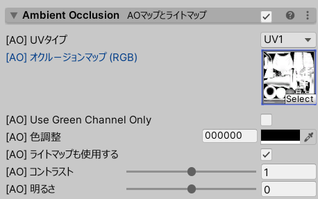

- `オクルージョンマップ` に Occlusion Map を設定してください。
- Lightmap static を付与したメッシュであればライトマップを読み取ることができます。`ライトマップも使用する` にチェックを入れてください。
- オクルージョンマップやライトマップの合成にて `明るさ` と `コントラスト` を調整できます。

### Emission エミッション {#Emission}

エミッションの設定です。

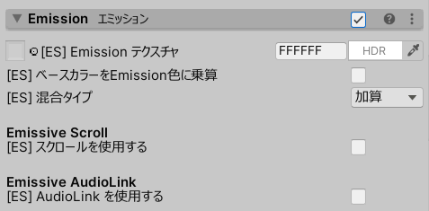

- Emission Map および Emission Color を `Emission` に設定してください。
- `混合タイプ` を ADD(加算合成) と ALPHA(ブレンド) から選ぶことができます。

EmissiveScroll を使用する時は `スクロールを使用する` をチェックしてください。

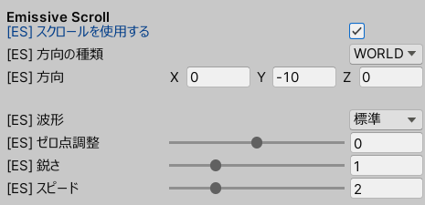

- `方向の種類` では、スクロールするときの座標系を WORLD_SPACE(ワールド空間)、LOCAL_SPACE(ローカル空間)、UV1、UV2 から選ぶことができます。
- EmissiveScroll の `波形` を数種類から選ぶことができます。波形を「カスタム」に設定すると、波形をグラデーションマップテクスチャにて指定することができます。

Emission を AudioLink と連動させるときは `AudioLink を使用する` をチェックしてください。

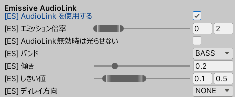

チェックを入れた場合、AudioLink が有効なワールドでは EmissiveScroll を上書きして Emissive AudioLink が使用されます。AudioLink が無効なワールドでは Emission および EmissiveScroll が使用されます。

- `AudioLink無効時は光らせない` をチェックすると、AudioLink が無効なワールドでは Emission 自体が無効になります。
- `ディレイ方向` にて AudioLink のディレイを指定できます。UV1_X or Y、UV2_X or Y、または UV1_TEX から選ぶことができます。UV1_TEX を選択したときの「ディレイ制御テクスチャ」は、黒が遅延なし、白が遅延最大となるマスクテクスチャを指定します。
  - `ディレイ反転` をチェックするとディレイ方向が反転します。

### Fog フォグ {#Fog}

メッシュ原点から離れた場所に、指定された色をブレンドします。

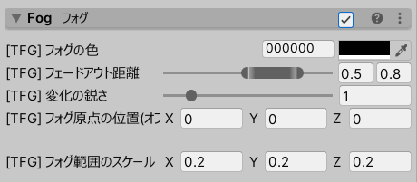

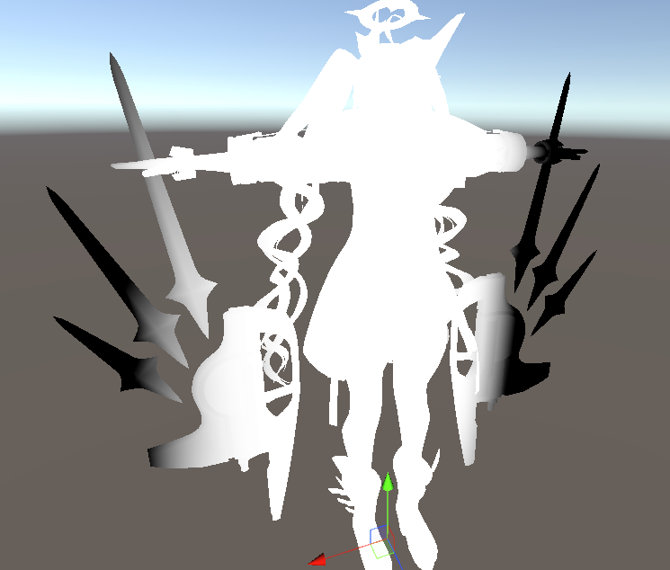

フォグがブレンドされるのは次の条件をいずれも満たした部位です。
1. 原点から `フェードアウト距離` 以上離れている
2. 原点よりもカメラから遠い

- メッシュ原点の位置を `フォグ原点の位置(オフセット)` にて微調整できます。
- フォグ効果範囲の微調整 (縦長にしたい等) には `フォグ範囲のスケール` を調整してください。(1, 1, 1) では等倍で、0.5にするとその座標軸のみフェードアウト距離の数値が半分に(より原点に近い場所からフォグが始まる)ようになります。

### Dissolve ディゾルブ {#Dissolve}

メッシュ出現・消去時の特殊効果を設定できます。

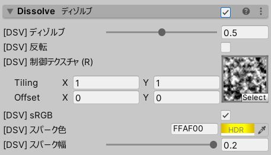

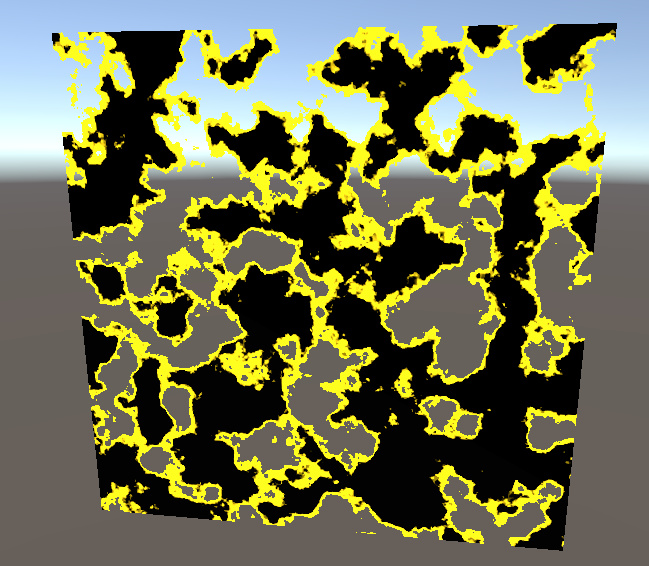

- `ディゾルブ` を操作することでメッシュ出現・消去を変化させられます。0 が完全透明、1 が完全不透明です。
  - この項目を AnimationClip から変更してください。
- 出現消去の仕方は `制御テクスチャ` にて設定できます。
  - ディゾルブを 0→1 に変更してメッシュを出現させる場合、黒が最初に出現する場所、白が最後に出現する場所です。
  - ディゾルブを 1→0 に変更してメッシュを消去させる場合、白が最初に消える場所、黒が最後に消える場所です。
- `反転` をチェックすると、制御テクスチャの白黒が反転されます。「反転ONかつディゾルブ1→0」のアニメを作ると、最初に出現した場所が最初に消去されるようになります。

### Lit ライト設定 {#Lit}

ライトに対する反応の設定です。

- `Unlit Intensity (最小明度)` は、ライトの明るさが 0 のときに明度に乗算される係数です。0 に指定すると明るさ 0 のときに真っ黒(明度が0)になります。1 に指定するとライトの明るさに依らずUnlitのように明るく描画されます。初期値 0.125 では暗くなりますが、明るさ 0 でもテクスチャの模様は判別可能です。
- `Saturate Intensity (飽和明度)` は、明度1.0倍となるライトの明るさを設定します。低い値を指定すると、多少暗くても指定された値以下にならないとライトの明るさに反応しないようになります。
- `Chroma Reaction (彩度)` はライト色彩に対する追従度です。0 ではライトの色彩に反応しません。値を大きくするほどライト色彩に影響するマテリアルになります。初期値 0.8 では「ライト色彩の影響は受けるが、Standard Shader と比較すると色付きが穏やか」に調整されています。
- `他の物体に影を落とす` は、SkinnedMeshRenderer の `Cast Shadows` と同様の設定項目です。チェックを外すと影を落としません。

UnToonのライト応答特性は、次のようにクランプ付き１次関数となっています。`Unlit Intensity` と `Saturate Intensity` は以下のようになります。
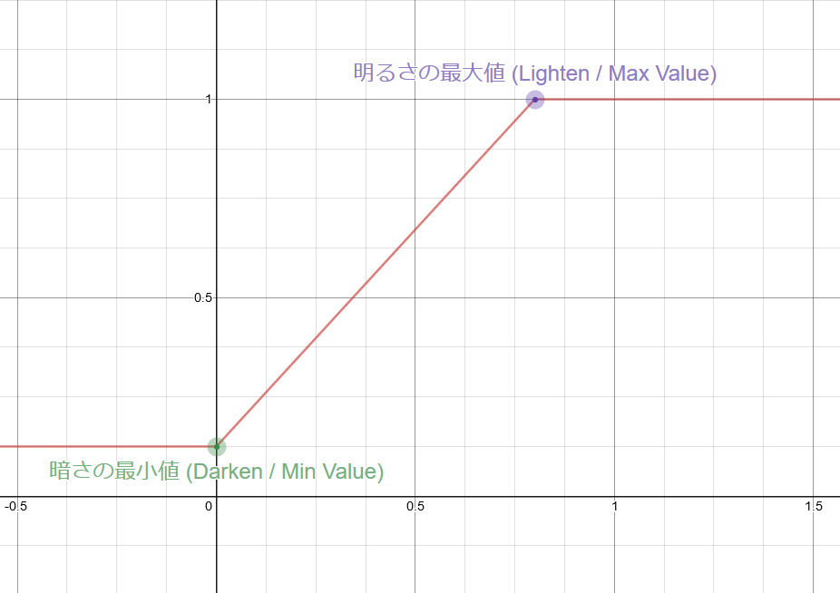

### Lit Advance ライト設定(拡張) {#LitAdvance}

ライティングに関する追加の設定です。通常は変更する必要はありません。

- `太陽光のモード` では、マテリアルが基準とする Realtime Light を選ぶことができます。
  - **AUTO(自動)** ワールドに配置されたライトを元に自動で Realtime Light を選択します。
  - **ONLY_DIRECTIONAL_LIT(DirectionalLightのみ)** ワールド内の Realtime Directional Light を基準にします。
  - **ONLY_POINT_LIT(PointLightのみ)** ワールド内の Realtime Point Light、厳密には Light1 を基準にします。
  - **CUSTOM_WORLDSPACE(カスタム(ワールド方向))** 下欄 `カスタム太陽の方角` `カスタム太陽の高度` で指定されたワールド方向を光源として扱います。
  - **CUSTOM_LOCALSPACE(カスタム(ローカル方向))** 下欄 `カスタム太陽の方角` `カスタム太陽の高度` で指定されたローカル方向を光源として扱います。
  - **CUSTOM_WORLD_POS(カスタム(ワールド座標))** 下欄 `カスタムライトの位置` で指定されたワールド座標を光源として扱います。
- `逆光補正しない` にチェックすると、光源方向による ToonShade と RimLight の補正をしません。
  - ワールド構造物のように、static かつ大きなメッシュである場合にはチェック推奨です。
- `メッシュ原点を取得しない` にチェックすると、一部の処理でメッシュ原点を取得しないようになります。
  - Batching Static を付与したメッシュ(バッチ処理にて原点位置が変わってしまう)である場合にはチェック推奨です。

### Light Bake Effects ライトベイク調整 {#LightBakeEffects}

ライトベイク時のライトマッパーからの見え方を調整します。ライトベイク以外には影響を与えません。

- `間接光の倍率` は、0 にすると間接光が黒色になります。間接光が明るすぎる・暗すぎる場合に調整します。
- `Emissionの倍率` は、0 にするとEmissionが黒色になります。発光が明るすぎる・暗すぎる場合に調整します。
- `間接光の彩度` では、0 にすると間接光が灰色になります。間接光の色が強い場合などに調整します。

### Tessellation 細分化 {#Tessellation}

UnToonのTessellationシリーズでは、テッセレーションを用いたメッシュの細分化・スムージングを行うことができます。
細分化はカメラとメッシュの距離に応じて行われ、遠距離では無効化され最大パフォーマンスとなり、近距離では最大化されて最大クオリティとなります。

- `分割数` ではポリゴンの分割レベルを制御できます。値が小さいほど荒く、大きいほど細かくなります。デフォルトは 4 で、通常は変更する必要はありません。
- `スムーズ` ではスムージング強度を制御できます。0 ではスムージングが行われません。デフォルトは 1 で、通常は変更する必要はありません。
- `スムーズマスク` には、スムージングする範囲を白、しない範囲を黒で指定したマスクテクスチャを設定します。部分的にスムージング強度を変更することで、例えばハードエッジなパーツをスムージング対象から外したり、肌が衣服を突き抜けることを防止することができます。

### Stencil ステンシル {#Stencil}

UnToonでは簡易なステンシル制御として、Mask で描画した範囲に MaskOut が描画しないよう制御することができます。
例えば「瞳」に Mask を指定し、「前髪」に MaskOut を指定して、瞳が常に前面に描画されるようにすることができます。
Mask 側のシェーダは `WF_UnToon_Transparent_Mask`、MaskOut 側のシェーダは `WF_UnToon_Transparent_MaskOut` です。
他のバリアントにも Mask と MaskOut を用意しています。
また MaskOut_Blend では MaskOut に加えて半透明合成を利用可能です。これで瞳が前髪と50%アルファ合成されるように描画することができます。

- `ID` で指定した値が同じものどうしでステンシルが動作します。

