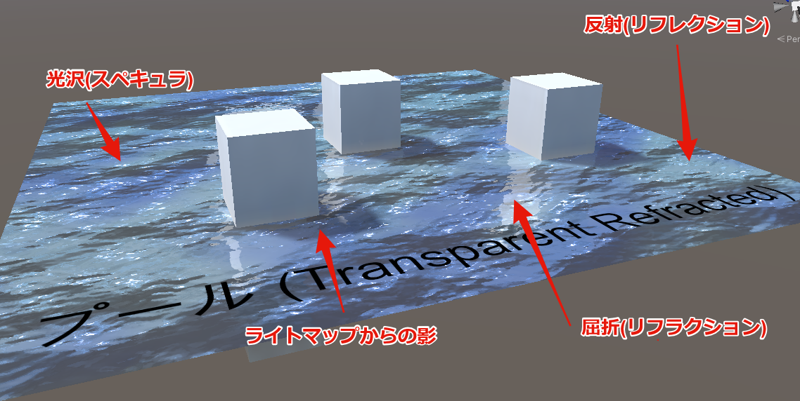

# UnlitWF/Water

UnlitWF/Water は、水面を描画するシェーダと付属の特殊効果を描画するシェーダで構成される、水シェーダのアセットです。
このページでは UnlitWF/Water の設定方法について説明します。

## サンプルマテリアル

設定済みマテリアルが `/Examples/Water/Presets/Materials` に収録されています。
複製してご利用ください。

## UnlitWF/Water の特徴

- 軽量
- VRC Quest でも動作します。
- ワールドライティングにはあまり影響されずに描画されるUnlit的な挙動です。
- ライトマップ経由でベイクされた影を受け取ることができます。
- 基本的に CameraDepthTexture は使用しません。CameraDepthTexture を使用する場合はヘルプボックスでお知らせします。

## シェーダの全体構成について

WF_Water では、複数のシェーダとマテリアルの組み合わせで、水を描画します。

- 水面の描画
  - WF_Water_Surface (Opaque, Transparent, Transparent_Refracted)
- コースティクスの描画
  - WF_Water_Caustics (Addition)
- 深度の描画
  - WF_Water_DepthFog (Fade)

----

## 水面の描画

WF_Water_Surface シェーダが水面を描画します。

### RenderTypeの選び方

WF_Water_Surface シェーダには RenderType の異なる3種類が存在します。

- WF_Water_Surface_Opaque
  - 不透明シェーダです。水面下の描写(屈折・コースティクス・深度・その他の水面下のジオメトリ)が不要なときに使用してください。
  - 不透明シェーダのため、RenderQueue に関係する描画不良を起こさないメリットがあります。
- WF_Water_Surface_Transparent
  - 半透明シェーダです。水面下の描写(コースティクス・深度・その他の水面下のジオメトリ)を透過して確認することができます。屈折のみ利用できません。
- WF_Water_Surface_Transparent_Refracted
  - 上記の Transparent に『屈折』機能を追加したものです。品質は最高ですが、他のシェーダと比較すると高負荷です。
  - Quest環境では動作しないため、他シェーダに差し替える必要があります。(自動で差し替えるサポート機能を用意しました。後述)

以下、サンプルとして同梱している `mat_Day_Pool (TransparentRefracted)` を例に設定項目を解説していきます。

### Surface - 基本設定と透過 {#SurfaceBase}

基本色と透過度の設定を行います。

水面の色は2色まで指定することができます。波面ハイトマップから計算した波高に基づき、2色をブレンドして描画します。

### Surface - 波面の生成 {#SurfaceWaving}

水面を移動する波面を生成します。以下の設定が計3セット用意されていて、WF_Water_Surface では最大で3つまでの波面を合成して描画することができます。

`UVタイプ` には UV1, UV2, WORLD_XZ を選ぶことができます。

- UV1: 水面メッシュのUV1を基準に波面を生成します。
- UV2: 水面メッシュのUV2を基準に波面を生成します。
- WORLD_XZ: ワールドXZ平面を基準に波面を生成します。

サンプルでは WORLD_XZ を設定しています。この設定では波の大きさはメッシュの大きさと相関しないため、どの大きさのメッシュにも適用可能です。一方 WORLD_XZ では垂直面が正しく描画されません。
UV 展開したメッシュであれば UV1 や UV2 のほうが適切になるため、適用先のメッシュの都合と合わせて調整してください。

### Surface - 光沢(スペキュラ) {#SurfaceSpecular}

水面に光沢を付与します。WF_Water_Surface では最大2色までの光沢を追加できます。

`滑らかさ` は、Standard シェーダにおける Smoothness に相当するパラメータです。滑らかさが大きいほど、光沢は狭く鋭くなります。滑らかさが小さいときは、光沢は広く淡くなります。

### Surface - 反射(Reflection) {#SurfaceReflection}

水面に反射を付与します。

サンプルマテリアルでは `キューブマップ混合タイプ` が CUSTOM に設定されていて、キューブマップが明示的に指定されています。
ここを REFLECTION_PROBE に変更すると、指定したキューブマップではなくワールド側でベイクされた ReflectionProbe が映り込むようになります。

### Surface - 屈折(Refraction) {#SurfaceRefraction}

水面下の屈折描写を追加します。(TransparentRefracted のみ)

`屈折率` と `距離` のパラメータを変更すると、屈折による歪みの量を変化させることができます。

### Surface - 距離フェード {#SurfaceDistanceFade}

視点から一定距離離れた先の色を調整できる機能です。

`フェード距離 (Near)` と `フェード距離 (Far)` の単位はメートルです。Near で指定した距離だけ離れた位置から色調整が始まり、Far で指定した距離になると色調整が最大になります。

### Surface - AOマップとライトマップ {#SurfaceAmbientOcclusion}

ライトマップを読み取って影を描画する場合は有効にしてください。なお水面をライトベイクする際の注意点は後述します。

`コントラスト` の初期値は 1.0 ですが、水面に使う場合は 0.4～0.8 くらいとするのが良いと思います。影が弱めに描画されます。

### Surface - ライト設定(拡張) {#SurfaceLitAdvance}

光源方向をカスタマイズできます。光源方向は『光沢(スペキュラ)』およびLambert影にて使用されます。

設定方法は [UnToon Manual -> Lit Advance](https://github.com/whiteflare/Unlit_WF_ShaderSuite/wiki/UnToon-Manual#lit-advance) と同様です。
初期値は AUTO なので、通常は変更せずとも大丈夫のはずです。カスタマイズする際に変更してください。

----

## コースティクスの描画

WF_Water_Caustics を用いると水底にコースティクスを描画することができます。

### メッシュの用意

WF_Water_Caustics はコースティクスのみ描画するシェーダなので、水底のメッシュは別に必要です。
水底メッシュと同じ形状のメッシュを別に用意し、そこに WF_Water_Caustics を割り当ててコースティクスを描画します。

簡単に行う場合、水底メッシュを Unity 上で複製してコースティクス用メッシュとしても大丈夫です。設定から水上部分にコースティクスを描画しないようにできるため、水上に出ている部分のある水底メッシュであってもそのまま複製して利用できます。

以下、サンプルとして同梱している `mat_DayFX_Caustics` を例に設定項目を解説していきます。

### Caustics - 基本設定 {#CausticsBase}

コースティクスの色を指定できます。

### Caustics - 水 {#CausticsWater}

水面高と、水上でコースティクスを非表示にするかどうかを設定できます。

`水面高` はワールド座標上での水面のY座標を指定してください。初期値は 0 です。
コースティクスが表示されない場合、水面高が正しく設定されているか確認してください。

### Caustics - 波面の生成 {#CausticsWaving}

WF_Water_Surface と同様の設定項目が WF_Water_Caustics にもあります。ただしこちらはノーマルマップ＆ハイトマップではなく、コースティクステクスチャを指定します。

コースティクステクスチャは単純なUVスクロールを行います。必要に応じてパターンを差し替えてみてください。

### Caustics - AOマップとライトマップ {#CausticsAmbientOcclusion}

WF_Water_Surface と同様、WF_Water_Caustics でもライトマップを読み取ることができます。
影の部分はコースティクスが弱めに描画されます。

`コントラスト` の初期値は 1.0 ですが、水面に使う場合は 0.4～0.8 くらいとするのが良いと思います。影が弱めに描画されます。

----

## 深度の描画

水の透明度・不透明度を『深度 (DepthFog)』として描画することができます。
水深が深くなるにつれて水底が見えにくくなるといった効果を追加することができます。

マテリアルの設定先は、コースティクスと同じく水底メッシュ(を複製したもの)です。
コースティクスと併用したい場合は、『水底メッシュ』『コースティクスメッシュ』『深度メッシュ』の3つを用意してください。

以下、サンプルとして同梱している `mat_DayFX_DepthFog` を例に設定項目を解説していきます。

### DepthFog - 基本設定と水 {#DepthFogBase}

フォグの色を指定できます。水中での距離が長ければ長いほどフォグが強く掛かり、最終的に `フォグの色` で指定した色に集束します。

`水の透明度` の単位はメートルです。10と指定した場合、10メートル先はフォグが最大になるため水底を判別できなくなります。

----

## 光源からの反射の描画

水面への光源の映り込みを『Sun Reflection』『Lamp Reflection』機能で描画することができます。

マテリアルの設定先は水面メッシュ(を複製したもの)です。

以下、サンプルとして同梱している `mat_NightFX_SunReflection` `mat_NightFX_LampReflection` を例に設定項目を解説していきます。

### Sun Reflection {#SunReflection}

太陽光からの反射を描画します。太陽の方向は `太陽の方角` `太陽の高度` から設定してください。
`Cookie` に設定したテクスチャで映り込みを行います。
反射の色は `Reflection Color` で設定してください。

### Lamp Reflection {#LampReflection}

点光源からの反射を描画します。光源の位置は `位置` から設定してください。メッシュの設定したオブジェクトを起点としたローカル座標系で位置を指定します。
`Cookie` に設定したテクスチャで映り込みを行います。
反射の色は `Reflection Color` で設定してください。

LampReflection は Batching(Dynamic|Static) を無視しますが、GPU Instancing により多数のオブジェクトを一度に描画することができます。
マテリアル設定の `Enable GPU Instancing` がチェックされている場合、同一マテリアルのオブジェクトがひとつの SetPassCall にまとめられ、負荷を軽減することができます。

----

## ライトベイクする際のポイント

Water_Surface および Water_Caustics はライトマップを読み取ることができます。水面メッシュおよびコースティクスメッシュをライトベイクする際には、次の点を注意してください。
- メッシュの Cast Shadows は Off にする (水面もコースティクスも影を落とさないので)
- 水面orコースティクスマテリアルの DoubleSidedGlobalIllumination にチェックする

画像で示すと次の状態になります。

なお、DoubleSidedGloballIllumination がチェックされていない場合、次のような情報が表示されます。ここで `Fix Now` を押しても修正することが可能です。

## RenderQueue 設計について

各シェーダおよびマテリアルの RenderQueue は、初期値として次のようになっています。

- 2000: (ワールドやアバターの不透明メッシュ)
- 2500: (スカイボックス)
- 2920: WF_Water_Caustics
- 2930: WF_Water_DepthFog
- 2950: WF_Water_Surface_Transparent および WF_Water_Surface_Transparent_Refracted
- 3000: (ワールドやアバターの半透明メッシュ)
- 3051: WF_Water_Sun
- 3052: WF_Water_Lamp

このため次のように描画されます。

- メリット
  - 水底メッシュ(ワールドの不透明メッシュ) の後に Caustics と DepthFog が描画される。
  - Caustics の後に DepthFog が描画される。Caustics は DepthFog で隠すことができる。
  - Caustics と DepthFog の後に Water_Surface が描画される。
  - アバターの半透明メッシュは Water_Surface の後に描画される。そのため Water_Surface はアバターの半透明メッシュを隠さない。
- デメリット
  - 水中にある半透明メッシュが Water_Surface よりも強くなってしまう。水中メッシュの上に水面を被せられない。
  - 半透明メッシュが屈折により揺れない。一方で水上の不透明メッシュは屈折で揺れるため、半透明メッシュの服を着たアバターは肌色が揺れて見えてしまう。

デメリットの解消のため、次のことを試してみてください。

- ワールドの半透明メッシュを水中に設置する場合 Water_Surface よりも小さい2950未満を RenderQueue に指定する。
- アバターが水中に進入しないように、コライダーでふさいでしまう。
- もしアバターが水中に進入するのであれば、Water_Surface の RenderQueue を 3100 程度に変更する。
  - この対処は、アバターの半透明メッシュでZWrite=OFFとなっているものより Water_Surface が強くなってしまうため、それらが期待通り描画されない場合があります。

あるいは Water_Surface_Opaque を利用することもできます。水面下の表現ができなくなる代わりに、RenderQueue まわりの煩わしい考慮が不要になります。

## Quest 対応について

Water_Surface_Transparent_Refracted で利用可能な『屈折』機能は Quest で動作しません。屈折を除いた Water_Surface_Transparent に差し替える必要があります。
差し替えはツールから一括で行うことが可能で、マテリアルを選択して `UnlitWF Material Tools` → `シェーダ切り替え` → `モバイル向けシェーダに変換する` で変更できます。

なお、こちらの機能はフォルダ単位で選択して「モバイル向けシェーダに変換する」を行っても問題ないように作られています。

- UnlitWF のシェーダのうち Quest でも動作するマテリアルは、何も変換しません。
- UnlitWF のシェーダのうち Quest で動作しないマテリアルは、Quest で動作するシェーダに差し替えられるか、または無効化されます。
- UnlitWF のシェーダではないマテリアルは、何も変換しません。

どうぞご活用ください。

