UnlitWF にはマテリアルの設定・調整を行う Unity 拡張ツールが同梱されています。

## 各ツールの起動方法

マテリアルを右クリックして `UnlitWF Material Tools` から各ツールを起動してください。

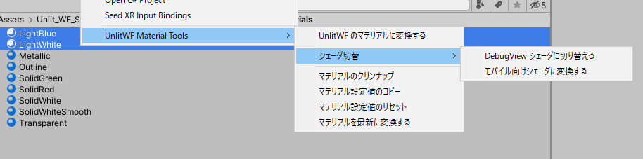

なお、メニューはデフォルトで英語表記です。日本語表記にはUnityメニューの `Tools` → `UnlitWF` → `メニューの言語を日本語にする` から変更することができます。

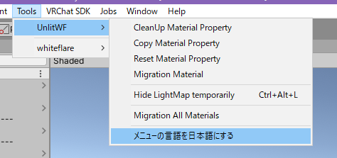

## マテリアル変換系ツール

### Convert UnlitWF material / UnlitWFのマテリアルに変換する {#ConvertWFMaterial}

UnlitWF/UnToon のシェーダ **ではない** シェーダを用いているマテリアルを、UnlitWF/UnToon のシェーダに切り替えます。既に UnlitWF のシェーダを使用しているマテリアルは変更されません。
他シェーダからの一括変更や、InternalErrorShader からの復旧にご利用ください。

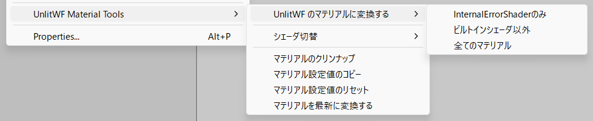

1つのマテリアル、複数のマテリアル、あるいはProjectウィンドウ内のフォルダを右クリックして変更できます。

1. InternalErrorShaderのみ
    - マテリアルエラーを起こしているマテリアルのみUnlitWFシェーダに変更します
2. ビルトインシェーダ以外
    - UnityビルトインシェーダではないマテリアルについてUnlitWFシェーダに変更します
3. 全てのマテリアル
    - 全てのマテリアルをUnlitWFシェーダに変更します

### Change Mobile shader / モバイル向けシェーダに変換する {#ChangeMobileShader}

マテリアルに使われているシェーダが VRC Quest (ワールド) で動作しないシェーダである場合は、VRC Quest でも動作するシェーダに一括変更します。
既に VRC Quest で動作するシェーダの場合、およびマテリアルが UnlitWF のシェーダではない場合は何もしません。

### Switch DebugView Shader / DebugViewシェーダに切り替える {#SwitchDebugView}

マテリアルを一時的にデバッグ用シェーダへ変更します。なお、この機能はマテリアルのコンテキストメニュー(Inspectorの歯車マーク)からも呼び出すことができます。

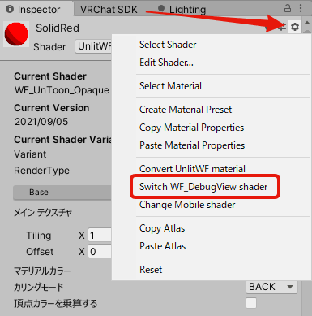

DebugView では UV や法線など様々な数値を可視化できます。

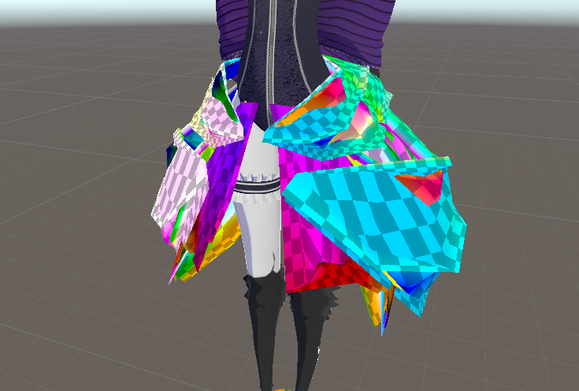

シェーダを元に戻すときには `Switch Prev Shader` ボタンを押してください。元のシェーダへと切り替わります。
元のシェーダは UnlitWF/UnToon だけでなく、StandardShader や他シェーダからも切り替え・切り戻し可能です。ご活用ください。

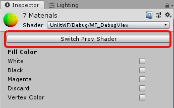

## マテリアル編集系ツール

### CleanUp material property / マテリアルのクリンナップ {#CleanUp}

マテリアル内の未使用の設定を消去します。不要なテクスチャ参照や無効化された機能などのクリーンナップにご利用ください。

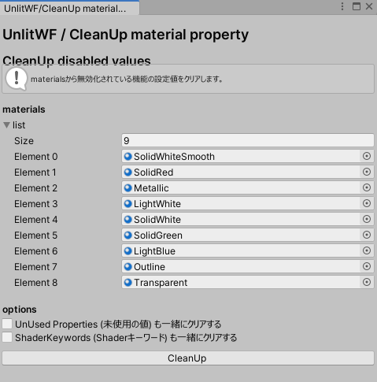

これと同じ機能が、マテリアルの Inspector 最下部からも利用できます。`マテリアルから不要データを削除` を選択してクリーンナップできます。

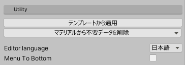

なお、VRRCSDK3_Avatar にてアバターをビルドする際は、アバターに使用されたマテリアルが自動でクリンナップされます。

### Copy material property / マテリアル設定値のコピー {#CopyProperty}

コピー元マテリアルからコピー先マテリアルへ、プロパティ値をコピーします。コピー範囲は機能ごとに指定できます。異なるシェーダ間の値のコピーも可能です。

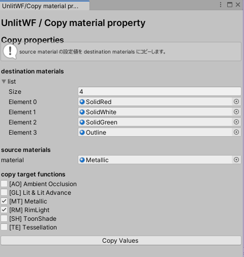

### Reset material property / マテリアル設定値のリセット {#ResetProperty}

マテリアルのプロパティ値を初期化する際に使用します。

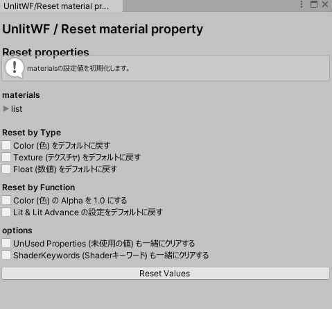

### Migration material / マテリアルを最新に変換する {#Migration}

マテリアルが古いバージョンの UnlitWF/UnToon で作成されていた場合に、新しいバージョンへとマイグレーションします。
古いバージョンのプロパティ値が保存されていない場合はマテリアルは変更されません。

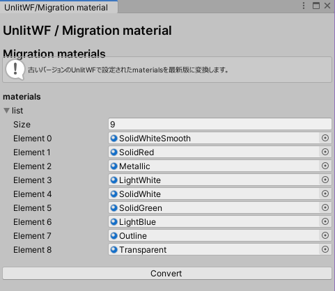

このツールで行う変更は、シェーダのインスペクタで「このマテリアルは古いバージョンで作成されたようです。最新版に変換しますか？」に **Fix Now** した場合と同じ変更です。このツールでは複数マテリアルを一括選択して変更するために用意されています。

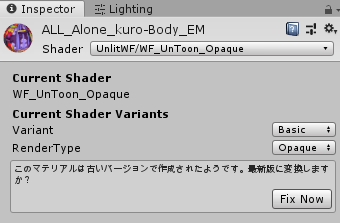
