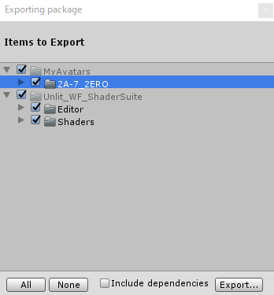

# UnToon Redistribution 再配布について

ここでは UnlitWF(UnToon含む) を再配布する場合について解説します。

## マテリアルの配布先に UnlitWF シェーダも導入してもらうために

UnlitWF を利用したマテリアルを作成しそれを配布した場合、インポート先の Unity プロジェクトにも UnlitWF を導入する必要があります。
プロジェクトに UnlitWF を導入する方法は、次の3種類です。

- 方法1: 配布先にて UnlitWF のアセットを取得してもらい、プロジェクトに導入してもらう。
    - 方法1-1: VPMリポジトリ経由で UnlitWF をインポートしてもらう 【[手順](https://github.com/whiteflare/Unlit_WF_ShaderSuite/wiki/UnlitWF-VPM-package-Installation-procedure)】
    - 方法1-2: UnlitWF の unitypackage をダウンロードしインポートしてもらう 【[ダウンロード](https://github.com/whiteflare/Unlit_WF_ShaderSuite/releases)】
- 方法2: UnlitWF の unitypackage を配布先に渡し、プロジェクトに導入してもらう。【再配布】

## VPMリポジトリ経由で UnlitWF シェーダを導入する

2023/05現在、VPMリポジトリ経由でのインポートが簡潔で便利です。[手順を解説したページ](/docs/unlitwf/VPM-package-Installation-procedure)を用意しましたので、URLを配布先にお伝え下さい。
```
https://whiteflare.github.io/vpm-repos/docs/unlitwf/VPM-package-Installation-procedure
```

## unitypackageを再配布して UnlitWF シェーダを導入する

別の手段として、配布先に UnlitWF の unitypackage を渡してインポートすることも可能です。
UnlitWF の公式ページ以外での配布を【再配布】と呼称します。UnlitWF は再配布可能なライセンスにて頒布しております。

再配布の方法は、おおきく2種類あります。

1. UnlitWF の unitypackage を、そのまま zip などに同梱して相手方に渡す方法
2. マテリアルをエクスポートする際、UnlitWF のアセットも同時にエクスポートし、unitypackage 内に同梱して相手方に渡す方法

### 方法1. UnlitWF の unitypackage を、そのまま相手方に渡す

UnlitWF の[リリースファイル](https://github.com/whiteflare/Unlit_WF_ShaderSuite/releases)として公開している unitypackage は、そのまま再配布が可能です。
マテリアルをエクスポートした unitypackage とあわせて zip などにまとめ、相手方に渡すと良いです。

なお、フルパッケージはサンプルや素材などが含まれておりサイズが大きいため、もし気になる場合は `Unlit_WF_ShaderSuite_*_Core.unitypackage` などの必須リソースをまとめたコアパッケージ版のみ再配布することをおすすめします。

### 方法2. UnlitWF のアセットを同時にエクスポートして同梱する方法

マテリアルをエクスポートする際、UnlitWF のアセットも同時にエクスポートします。

#### 注意点

注意点として、エクスポート元のプロジェクトがVPM版パッケージを利用している場合 (Assets配下にUnlitWFのアセットが無い場合) は、エクスポートすべきアセットが無いため以下の手順はご利用いただけません。
前述の手順にて、VPM版パッケージもしくはunitypackageを相手に導入するようご案内ください。

#### 再配布するべきファイル、不要なファイル

UnlitWF の unitypackage にはシェーダとしての動作に必要なファイルの他にサンプル画像やREADMEなども含まれています。

- 動作に必要 : `Shaders` フォルダの `*.shader` および `*.cginc`、それから `Editor` フォルダの `*.cs`
- 動作に不要 : 上記以外のフォルダ配下およびドキュメント類

UnlitWF は `Shaders` フォルダおよび `Editor` フォルダ以外は不要なように作成されています。
著作権表示は `*.shader` と `*.cginc` に既に含まれています。LICENSE.txt や README.txt の同梱は、再配布にあたって含めなくても動作に影響はありません。

#### unitypackage で export するときの手順(例)

1. export するフォルダを Project から選択します。  
自作のオブジェクトを含めたフォルダ、および Unlit_WF_ShaderSuite から `Shaders` と `Editor` の、合計3フォルダを選択します。
2. 右クリックから `Export Package…` を選択します。
3. `Exporting Package` の下部 `Include dependencies` のチェックを外します。
4. `Export…` にて、unitypackage を保存します。

フォルダを選択して export すると、その配下のファイルを unitypackage としてエクスポートすることができます。次図のようになるはずです。



この状態から `Export…` することで、unitypackage に UnlitWF を同梱することができます。
なお UnlitWF のサンプルとして付属の `Texture` フォルダ内の画像を他の場所にコピーせず使用している場合は、その画像も含めて export するとよいでしょう。

## 付録. ライセンスの解説

UnlitWF は zlib/libpng にて配布されています。[^1] そのため、

- UnlitWF を利用したオブジェクトを unitypackage として export するにあたり、
  - 再配布自由 : UnlitWF の複製を unitypackage に同梱することができます。
  - 改変自由 : UnlitWF を改変したものを同梱することができます。
  - 利用方法不問 : 同梱した unitypackage を有償・無償問わず頒布できます。
- unitypackage の配布・販売にあたり、
  - UnlitWF の作者 (whiteflare) に対して連絡の必要はありません。
  - README や頒布サイトに作者名などを記載する必要はありません。
- 著作権の表示は shader ファイルなどに既に入っているので追加不要です。ただし unitypackage に UnlitWF が含まれていることを説明したほうが import する側にとっては有益でしょう。
- unitypackage 以外の方法で同梱・再配布することもできます。
- 免責 : 作者 (whiteflare) は UnlitWF の利用について一切の責任を負いません。

といった条件にて利用することができます。
再配布する際にも考慮していただけると幸いです。

[^1]: 20240907以前は MIT LICENSE にて配布していました。(参考:[The MIT License](https://licenses.opensource.jp/MIT/MIT.html))<br/>20240907以降は zlib/libpng License にて配布しています。(参考:[zlib/libpng license](https://licenses.opensource.jp/Zlib/Zlib.html))
