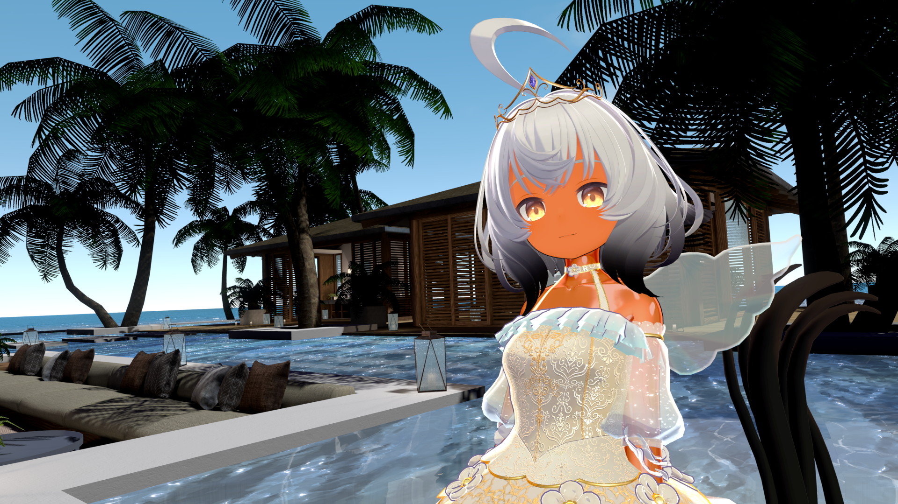

# UnlitWF/UnToon

UnlitWF/UnToon は、Unlit に様々な描画効果を追加する発想で設計された Unity/VRChat 想定の Toon Shader です。

アバターやワールドにUnlitWF/UnToonを使用してみたサンプルイメージです。Skybox以外は全てUnlitWFで描画しています。

# Dynamic Sample

Unity WebGL での動作サンプルです。UnlitWF/UnToon は WebGL でも動作します。

https://whiteflare.github.io/Unlit_WF_ShaderSuite/

# Supported

## Rendering Devices
- d3d11 - Direct3D 11 (VRChat PC platform)
- gles3 - OpenGL ES3.0 (VRChat android platform, WebGL2.0)

## Features / UnToonの機能
- Unlitの名を含んでいますが暗いところでは暗くなります。ただし真っ黒になることはなく、最小限のテクスチャ描画が読める程度には明るくなります。
- ライトを統合的に扱います。暗いDirectionalLightと明るいPointLightがあるとき、UnlitWF/UnToon はPointLight側をメイン光源として処理させます。
- カスタムインスペクタ(日本語対応済み、折りたたみ機能付き)を有しています。インスペクタとシェーダの依存は最小限にしているため拡張も容易です。
- 豊富な描画機能
  - (HSV) ColorChange
  - NormalMap
    - 2nd(Detail) NormalMap
  - Metallic
    - Metallic Reflection
    - Metallic Specular
    - 2nd CubeMap
  - Matcap (Additive/Multiply)
  - ToonShade (TwoGraded)
  - RimLight
  - Emission
    - constant Emission, or EmissiveScroll
  - ScreenTone Texture (Screen space texture blending)
  - Outline (NORMAL/EDGE)
  - AmbientOcclusion (reading AOMap/Lightmap)
  - support Baked GlobalIllumination

## Not Supported / UnToonではサポートされていないもの
- ShadowTexture
  - receive (realtime) shadow はサポートされません。不要な realtime shadow が掛からないようにしています。
  - realtime spot light も ShadowTexture がサポートされないため、光の境界を描画することができず light の効果内は常に照らされます。
- Directional Lightmap はサポートされず、NormalMapは常にrealtimeなblendを行います。

# Variants

UnToonには多数のバリアントがあります。

基本バリアント
- Texture
  - Unlit/Texture に相当、Queue=Geometry で描画する Opaque Shader
- TransCutout
  - Unlit/Transparent Cutout に相当、Queue=AlphaTest で描画する Cutout Shader
- Transparent
  - Unlit/Transparent に相当、Queue=Transparent で描画する Transparent Shader
- Transparent3Pass
  - CutoutとTransparentを同時に行う、不透明・半透明混在メッシュ向け Transparent Shader

グループ
- (Standard, no-named group)
  - UnToon の基本セット
- UnToon_Outline
  - Standard + アウトライン機能
- UnToon_Mobile
  - Standard よりも機能縮小し、OpenGL ES3.0 / WebGL2.0 で動作可能にした軽量版
- UnToon_PowerCap
  - Standard + Matcap増量版(計8枚まで使用可能)
- UnToon_Tessellation
  - Standard + アウトライン + Tessellation によるスムージング機能