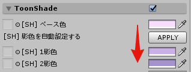

ここでは UnlitWF/UnToon の豆知識を紹介していきます。

***

## 影色を自動で設定する

UnToon には `影色を自動設定する` ボタンがあります。

`ベース色` にマテリアルの代表的な色をスポイトし、`APPLY` ボタンを押すと `1影色` および `2影色` が自動設定されます。

ベース色にスポイトする色は比較的どのようなものでも問題ありませんが、次のような色がベストです。
- 彩度(S)が低い、淡い色合い。
- 明度(V)が高い、明るい色合い。

このような色がマテリアルに無いときは、スポイト後に調整して淡い色合いにしてからAPPLYするのでも構いません。

取得したベース色を元に、影色は次のように自動計算されて設定されます。
- 1影色：ベース色から、色相を原色(赤緑青)に近付け、彩度を少し上げた色。
- 2影色：1影色に、さらに明度を少し下げた色。

***

## 顔に影が掛かりにくくなるように設定する

顔は凹凸が激しいため、とくに横からライトが当たった場合に影が掛かりがちになります。
次の画像は「スノウエルフのお嬢様」の顔の **カスタム法線を無効化** した状態での参考画像です。

UnToon には「アンチシャドウマスク」の機能があり、これで顔の部分を指定することで顔に影が掛かりにくくなるよう設定することができます。
次の画像は、カスタム法線を無効化したまま、アンチシャドウマスクの機能で影をコントロールしています。

アンチシャドウマスクを設定した状態でも、逆光になる場合は影が掛かります。

設定は ToonShade の一番下から行います。マテリアル全域に設定する場合は、白いマスク画像を設定する代わりに『マスク反転』にチェックを入れるだけで設定できます。

***

## フルカラーのマスクを使用する

Matcap および RimLight のマスクには、フルカラーのテクスチャを使用できます。Matcap や RimLight の色を場所によって変化させることができます。

***

## 特殊用途の UnToon バリアントについて

UnToon には特殊な用途向けのバリアントが用意されています。その紹介です。

### UnlitWF/UnToon_Mobile/WF_UnToon_Mobile_TransparentOverlay

表情パーツ用の UnToon バリアントです。ZTest / Blend Src Alpha / Blend Dst Alpha を細かく制御できることと、Z Offset を変更できるという特徴があります。
Z Offset を活用すると、ステンシルを使用せずにメッシュの前後関係を調整することが可能です。

Z Offset = 0 の状態。髪に頬染めが隠れています。

Z Offset = 0.1 にすると、メッシュが実際よりも 0.1m 手前に引き出されます。

### UnlitWF/Custom/WF_UnToon_Custom_OffsetOutline_Opaque

他メッシュに食い込んでいるようなメッシュにアウトラインを付ける場合、アウトラインが割れないように細工が施されています。

通常の WF_UnToon_Outline_Opaque (比較用)

WF_UnToon_Custom_OffsetOutline_Opaque を使用した場合

WF_UnToon_Custom_OffsetOutline_Opaque では、アウトラインの ZOffset だけでなく、メインメッシュの ZOffset も変化させることができます。食い込んでいる側のメッシュを僅かにカメラ側に引き出すことによりアウトラインが見栄え良くなります。

## Decal Texture の活用 (SKYBOX)

UnToon の Decal Texture で使用できるUVタイプに `SKYBOX` があります。これを用いると、メッシュの一部分に擬似的なスカイボックスを描画できます。

