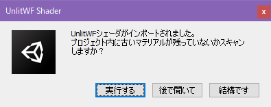

# UnlitWFのVPM版パッケージ導入手順

UnlitWFをVPMリポジトリ経由でプロジェクトにインポートする手順をご案内します。

1. リポジトリをVCCに追加する
2. UnlitWF Shader をプロジェクトに追加する

## アバター製作者様へのご案内

UnlitWFのインポート手順を他者に伝える場合、このページのURLをご案内いただけると便利です。
```
https://whiteflare.github.io/vpm-repos/docs/unlitwf/VPM-package-Installation-procedure
```

## 導入手順

### 1. リポジトリをVCCに追加する

UnlitWF Shader を配布しているVPMリポジトリをVCCに追加します。  
[VCCに追加する](https://whiteflare.github.io/vpm-repos/addrepos.html) を開いてください。VCCが起動し、リポジトリ追加のダイアログが表示されます。


`I Understand, Add Repository` ボタンを押すとVCCにリポジトリが追加されます。  
すでに追加済みの場合は次のようにエラーが出ますが、この場合は追加が済んでいるので後続の手順に進んでください。


### 2. UnlitWF Shader をプロジェクトに追加する

VCCにて追加先のプロジェクトの `Manage Project` に進みます。


`UnlitWF Shader` の右側の `+` ボタンを押すと、パッケージがプロジェクトに追加されます。


このとき `UnlitWF TexturePack` も同時に追加されます。  
UnlitWF Shader の Installed Version が `Not Installed` から具体的なバージョン番号に変化すれば導入完了です。


`UnlitWF Shader` が表示されない場合、コミュニティリポジトリが非表示になっている場合があります。
右上の `Selected Repos` から `whiteflare` のリポジトリにチェックを入れてください。


## FAQ

### インポートについてのFAQ

#### Q. UnlitWFを使用しているアバターのunitypackageを、UnlitWFをインポートするより先に導入してしまいました。復旧するにはどうすれば良いですか？

A. マテリアルとシェーダが連動していない場合、紫色(マゼンタ色)で表示されます。UnlitWFをまだインポートしていない場合は、このページの手順にてインポートすることにより、多くの場合は復旧します。  
UnlitWFをインポートしてもまだ紫色(マゼンタ色)から復旧しない場合、改めてアバターunitypackageをインポートすることで復旧させることができます。

#### Q. 追加しようとしているプロジェクトには、すでにunitypackage版のUnlitWFが入っています。その状態からVPMパッケージ版UnlitWFをインポートすることはできますか？

A. できます。VPMパッケージ版UnlitWFをインポートすると同時に、unitypackage版のアセット資材が削除されます。
`Unlit_WF_ShaderSuite` フォルダを移動している場合などにはアセット資材が削除されないことがあります。その場合はVPMパッケージ版を追加したあとに手動で削除してください。

#### Q. UnlitWFをインポートしたところ、以下のダイアログが表示されました。何を選べばよいですか？



A. 基本的に `実行する` を選んでいただいて構いません。プロジェクト内のマテリアルをスキャンし、古いマテリアル設定が見つかった場合はマテリアルを更新します。(最大数分かかります)  
プロジェクトにUnlitWFを新規インポートする場合など、プロジェクト内にUnlitWFのマテリアルが存在していないときには `結構です` を選んでも構いません。  
選択を保留してあとで決めたい場合は `後で聞いて` を選ぶこともできます。

なお、このダイアログがそもそも表示されない条件もあります。ダイアログが表示されていない場合は特に気にする必要はありません。

### 運用についてのFAQ

#### Q. unitypackage版UnlitWFとVPM版UnlitWFに互換性はありますか？ unitypackage版UnlitWFを利用したマテリアルをVPM版UnlitWFの環境で動作させた場合、問題はありますか？

A. unitypackage版とVPM版には互換性があります。相互運用においても問題は発生しません。
どちらのパッケージでマテリアルを作成しても差は発生しないため、一方の環境で作成したマテリアルを他方で使用しても問題ありません。  

#### Q. VPM版UnlitWFの提供開始に伴い、unitypackage版UnlitWFの提供は終了されますか？

A. しばらくは両方の配布形態を維持する予定です。2023年中のバージョンアップでは今まで通りunitypackage版の提供も予定しております。
2024年以降については未定です。

### その他のFAQ

#### Q. Add Repository のウィンドウ下部にある WARNING の意味は何ですか？

> **Community Repositories Disclaimer**  
> WARNING: Download at your own risk! Community Packages made available through third-party sites may contain malware. VRChat makes no representation, warranty, or guarantee with respect to Community Packages and disclaims any liability arising out of or related to Community Packages.

A. CommunityRepository は(VRChatの監修を受けていない)サードパーティによって運営されており、ダウンロードと同時にマルウェアが混入するリスクさえも考えられることをユーザに説明しています。  
これは jp.whiteflare.vpm リポジトリに限った話ではなく、仕組み上は CommunityRepository 全般で同じ状況となっています。  
リスクを回避するためには、出所不明のVPMリポジトリを無闇に登録することは避けましょう。

#### Q. VPM版パッケージを入れ直したいです。unitypackage版を上書きインポートすることはできますか？

A. VPM版パッケージを利用しているプロジェクトに、UnlitWFのunitypackageを入れることはできません。
入れようとした場合、次のダイアログが表示され、インポートがキャンセルされます。


VPM版パッケージを入れ直す場合は、VCC等から操作を行ってください。
