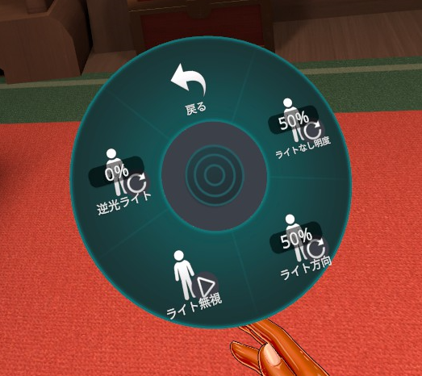
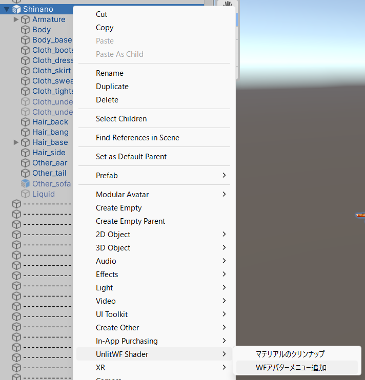

# UnlitWF アバターメニュー

VRCSDK3 アバター向けに、マテリアルを微調整するExpressionメニューを追加できます。

## アバターメニューの使い方

- `ライトなし明度`
	- ライト[^1]からの光がゼロのときの明るさを調整します。50% のときは標準値、値を大きくすると明るく、値を小さくすると暗くなります。
- `ライト方向`
	- ライト無しシーンでのライト方向を調整します。0% がワールド座標系 -Z 方向、50% がワールド座標系 +Z 方向で、ラジアルパペットで方向を調整できます。
- `ライト無視`
	- オンにすると、シーンにライトが合っても `ライト方向` をマテリアルに適用します。
- `逆光ライト`
	- アバターに逆光ライトを使用したマテリアルが含まれているときに項目が現れます。逆光ライトの強度を調整できます。

数値はクライアント間で共有されます(Synced)。保存はされません(not Saved)。

[^1]: リアルタイムライトとライトプローブを含む

## アバターへの導入方法

Hierarchy にてアバターを右クリックして `UnlitWF Shader` → `WFアバターメニュー追加` を選択して、コンポーネントをアバターに追加します。

- コンポーネントはアバター内のどこに配置されていても動作します。
- コンポーネントが複数設置されていてもひとつだけ設置されていたときと同じ動作となります。
- アバター内に UnlitWF のマテリアルが見つからなかった場合、メニューは追加されません。

## 依存パッケージについて

アバターメニュー追加の処理は `Modular Avatar` を利用しています。
https://modular-avatar.nadena.dev/ja

ModularAvatar を未導入の環境では、アバターメニュー追加の処理は無視されます。また「WFアバターメニュー追加」のメニューも表示されません。
