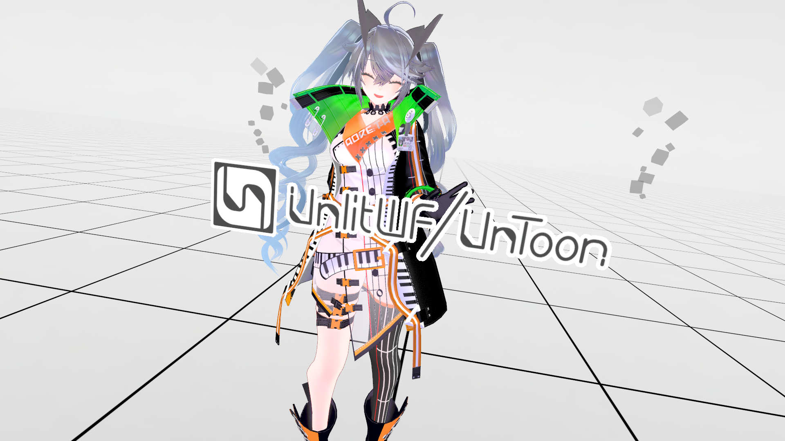

# UnlitWF Shader

UnlitWF_ShaderShuite は、Unity/VRChat での利用を想定した汎用シェーダパックです。
unitypackage には各種シェーダと、素材として利用可能な画像ファイル、サンプルシーンが含まれています。

## Example

WebGL で動作させたサンプルが https://whiteflare.github.io/Unlit_WF_ShaderSuite/ にあります。

## Download

- unitypackage
    - https://github.com/whiteflare/Unlit_WF_ShaderSuite/releases
- VPM経由でインポートする場合
    - [VPMパッケージ導入](/docs/unlitwf/VPM-package-Installation-procedure)

